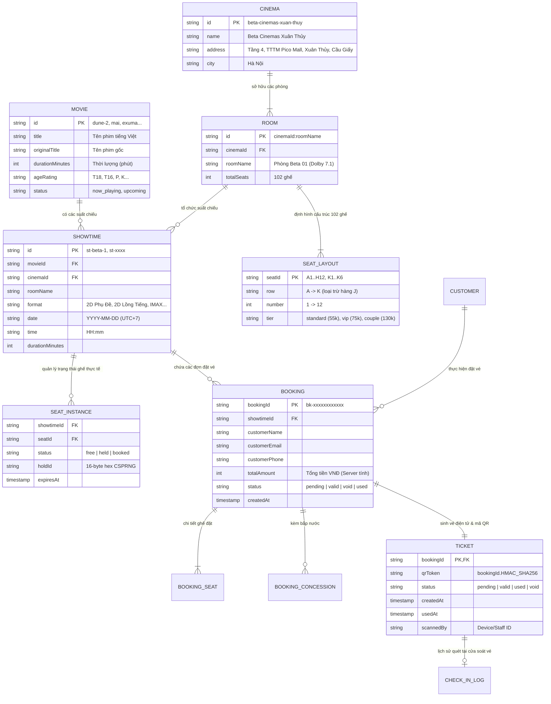

# 🗄️ CƠ SỞ DỮ LIỆU & KIẾN TRÚC LƯU TRỮ — CINEMAX AI
> **Phiên bản**: 2.0 (Chuẩn hóa State Machine & Upstash Redis REST)  
> **Dự án**: Nền Tảng Đặt Vé Xem Phim CineMax AI (Beta Cinemas)  
> **Thư mục**: `gđđ/` (Tài liệu Giai Đoạn Đầu)

---

## 1. TỔNG QUAN HỆ THỐNG DỮ LIỆU
Hệ thống lưu trữ của CineMax AI được thiết kế theo mô hình **Hybrid Storage** nhằm đáp ứng yêu cầu khắt khe của môi trường **Vercel Serverless**:
- **Tầng nghiệp vụ quan hệ (Logical Relational Layer)**: Định nghĩa các thực thể Phim, Rạp, Phòng chiếu, Suất chiếu, Ghế, Đơn hàng, Vé và Nhật ký soát vé.
- **Tầng lưu trữ phân tán hiệu năng cao (Physical In-Memory KV Layer - Upstash Redis)**: Sử dụng kết nối REST API không trạng thái (stateless), miễn nhiễm hoàn toàn với lỗi đứt kết nối lambda (cold starts / socket drops) và tích hợp các đoạn mã **Lua Scripts nguyên tử (Atomic Scripts)** để ngăn chặn 100% tình trạng **Overbooking (bán trùng ghế)**.

---

## 2. MÔ HÌNH THỰC THỂ MỨC LOGIC (LOGICAL ERD)



---

## 3. THIẾT KẾ CƠ SỞ DỮ LIỆU VẬT LÝ TRÊN REDIS (PHYSICAL KV SCHEMA)

### 3.1. Cơ chế Hash Tagging `{showtimeId}`
Để hỗ trợ chia cụm (Redis Cluster Sharding) và đảm bảo **các Lua scripts thực thi đa khóa (Multi-key Atomic Operations)** hoạt động 100% không bị lỗi `CROSSSLOT Keys in request don't hash to the same slot`, tất cả các key thuộc về cùng một suất chiếu đều sử dụng chung một Hash Tag `{showtimeId}`.

### 3.2. Bảng kê chi tiết các Khóa (Redis Keys & Data Types)

| Redis Key Pattern | Kiểu dữ liệu | TTL (Thời gian sống) | Mục đích & Ý nghĩa | Thao tác nguyên tử |
| :--- | :--- | :--- | :--- | :--- |
| `cinemax:{<showtimeId>}:seats` | **HASH** | Vĩnh viễn (hoặc đến khi suất chiếu kết thúc) | Lưu trạng thái thời gian thực của từng ghế:<br>• Field: `seatId` (VD: `A1`, `E6`, `K3`)<br>• Value: `"held"` hoặc `"booked"`<br>*(Nếu không có field thì mặc định là `"free"`)* | `HSETNX`<br>`HDEL`<br>`HMGET` |
| `cinemax:{<showtimeId>}:hold:<holdId>` | **STRING** (JSON) | 5 phút (Gia hạn tối đa trần 15 phút) | Chứa thông tin chi tiết phiên giữ ghế tạm thời:<br>```json<br>{"holdId": "c111...", "seats": ["A1", "A2"], "createdAt": 1727520000000, "expiresAt": 1727520300000}<br>``` | Lua Script `HOLD_SEATS`<br>Lua Script `RELEASE_HOLD`<br>TTL tự hủy |
| `cinemax:{<showtimeId>}:booking:<bookingId>` | **STRING** (JSON) | Vĩnh viễn | Lưu vết chốt ghế vĩnh viễn sau thanh toán, đảm bảo tính lũy đẳng (idempotent commit). | Lua Script `COMMIT_SEATS` |
| `cinemax:ticket:<bookingId>` | **STRING** (JSON) | 30 ngày | Lưu trữ toàn bộ bản ghi vé điện tử đầy đủ (`BookingInfo`), bao gồm thông tin phim, rạp, ghế, giá tiền, bắp nước và mã QR. | `SETNX`<br>`SET`<br>`GET` |
| `cinemax:ticket:used:<bookingId>` | **STRING** | 30 ngày | Khóa phân tán chống quét vé hai lần tại cửa rạp. Giá trị ghi lại ISO timestamp và ID máy quét. | `SET key "timestamp|staff" EX ... NX` |
| `cinemax:showtimes:rooms` | **SET** | Vĩnh viễn | Tập hợp các bucket key đại diện cho từng phòng chiếu để tra cứu danh sách suất chiếu. | `SADD`<br>`SMEMBERS` |
| `cinemax:showtimes:room:<roomHash>` | **STRING** (JSON Array) | Vĩnh viễn | Mảng danh sách các suất chiếu của một phòng cụ thể. Được bọc trong Distributed Lock khi xếp lịch. | `SET key:lock ... NX PX 8000` |
| `cinemax:showtime:<showtimeId>` | **STRING** (JSON) | Vĩnh viễn | Chỉ mục tra cứu trực tiếp suất chiếu O(1) theo ID (Direct Lookup Cache). | `GET`<br>`SET` |
| `cinemax:ratelimit:<prefix>:<id>:<win>` | **STRING** (Counter) | 60 giây | Quầy đo lưu lượng chống Spam / DDoS / Brute-force endpoint. | `INCR`<br>`EXPIRE` |

---

## 4. MÁY TRẠNG THÁI & CHU TRÌNH AN TOÀN DỮ LIỆU

### 4.1. Máy Trạng Thái Của Ghế (Seat State Machine)
```
[Free] ────(POST /api/seats - Lua HOLD_SEATS)───> [Held]
  ▲                                                 │
  │───(Hết 5p TTL / Nhả ghế / Vượt trần 15p)────────┤
  │                                                 ▼
  └───────(Hủy vé / Rollback Commit)─────── [Booked (Sold)]
```

- **Quy tắc trần cứng 15 phút (`MAX_HOLD_LIFETIME_MS = 900,000ms`)**: Ngăn chặn kẻ xấu giữ ghế liên tục (seat hoarding). Kể cả client có gửi heartbeat gia hạn liên tục, đúng 15 phút kể từ lúc tạo `holdId`, hệ thống tự động giải phóng ghế.

### 4.2. Máy Trạng Thái Của Vé (Ticket State Machine)
Chu trình 5 bước tài chính chuẩn chống thất thoát tiền & vé ma:
1. **PENDING**: Tạo vé ở trạng thái `pending` **TRƯỚC** khi gọi thanh toán (`ticketStore.createPending`).
2. **CHARGE**: Gọi cổng thanh toán (VietQR/MoMo). Nếu thất bại -> `voidTicket` ngay.
3. **COMMIT**: Chốt ghế nguyên tử từ `held` sang `sold` (`seatStore.commit`). Nếu mất ghế -> gọi `refund` ngay lập tức.
4. **VALID**: Kích hoạt trạng thái `valid` cho vé (`ticketStore.promotePendingToValid`).
5. **USED**: Khi nhân viên rạp quét mã QR -> kiểm tra chữ ký HMAC -> chuyển sang `used` qua lệnh `SETNX`. Không máy quét thứ hai nào có thể check-in thành công.

---

## 5. AN TOÀN & BẢO MẬT DỮ LIỆU (SECURITY GUARANTEES)
1. **Chữ ký mã QR chống giả mạo**: Mã QR chỉ chứa `bookingId.HMAC_SHA256(bookingId, TICKET_SIGNING_SECRET)`. Khi quét, hệ thống dùng `timingSafeEqual` để so sánh, loại bỏ hoàn toàn tấn công kênh phụ (Timing Attacks).
2. **Không rò rỉ PII**: API công khai tra cứu vé chỉ trả về thông tin suất chiếu & ghế, ẩn danh hoàn toàn số điện thoại, họ tên và email của khách hàng.
3. **Độc lập tính giá trên Server**: Giá vé (Standard 55k, VIP 75k, Couple 130k) và giá bắp nước hoàn toàn do server tính lại, từ chối mọi giá trị tiền do client gửi lên.
