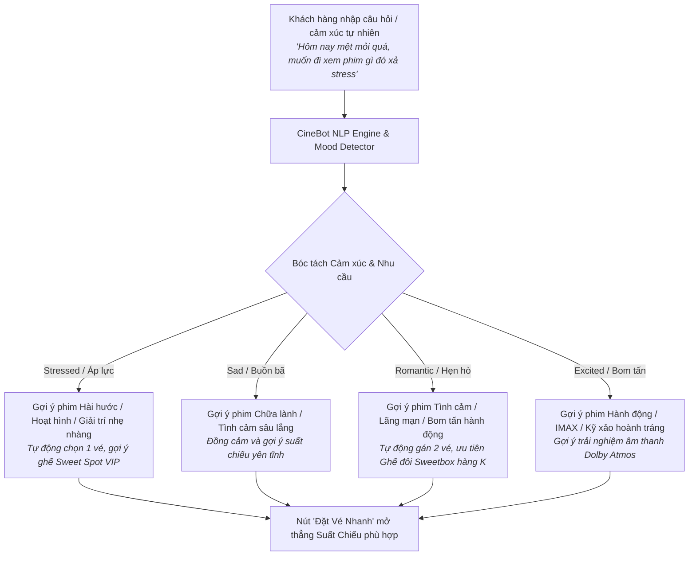

# 👥 BÁO CÁO PHÂN TÍCH KHÁCH HÀNG — CINEMAX AI
> **Dự án**: Nền Tảng Đặt Vé Xem Phim Trực Tuyến CineMax AI (Beta Cinemas)  
> **Thư mục**: `gđđ/` (Tài liệu Giai Đoạn Đầu)  
> **Mục tiêu**: Nghiên cứu hành vi, chân dung người dùng, phân tích tâm lý xem rạp và tối ưu hóa tỷ lệ chuyển đổi đặt vé (Conversion Funnel)

---

## 1. BỐI CẢNH & PHÂN KHÚC KHÁCH HÀNG MỤC TIÊU (TARGET AUDIENCE)

Thị trường rạp chiếu phim Việt Nam (đặc biệt là phân khúc rạp giá hợp lý như Beta Cinemas) phục vụ 4 nhóm khách hàng trọng tâm:

| Nhóm khách hàng | Đặc điểm nhân khẩu học | Thói quen & Tần suất xem | Yêu cầu cốt lõi khi đặt vé | Ghế & F&B ưa chuộng |
| :--- | :--- | :--- | :--- | :--- |
| **1. Cặp đôi (Couples / Dating)** | 18 - 28 tuổi, học sinh - sinh viên, nhân viên văn phòng | 2 - 4 lần/tháng, thường xem suất tối (18h30 - 21h30) và cuối tuần | Thích sự riêng tư, không gian thoải mái, đặt vé nhanh gọn, thanh toán QR tiện lợi | Ghế đôi **Sweetbox (Hàng K - 130k)**, Combo Bắp Nước Couple 2 ngăn |
| **2. Nhóm bạn trẻ (Gen Z / College Friends)** | 16 - 24 tuổi, học sinh, sinh viên các trường đại học | 1 - 3 lần/tháng, đi theo nhóm từ 3 - 6 người | Nhạy cảm về giá (giá vé 55k - 75k của Beta cực kỳ cạnh tranh), chọn ghế liền kề nhau | Ghế Standard hoặc VIP (Hàng E, F), mua Combo Solo hoặc mua chung bắp lớn |
| **3. Khán giả xem một mình (Solo Movie Buffs)** | 20 - 35 tuổi, người yêu thích điện ảnh, muốn giải tỏa stress | 2 - 5 lần/tháng, xem suất khuya hoặc ngày thường | Quan trọng chất lượng âm thanh/hình ảnh, vị trí nhìn trung tâm (Sweet spot) | Ghế VIP trung tâm (E5, E6, F5, F6), Combo Solo nhỏ gọn |
| **4. Gia đình trẻ (Young Families)** | 26 - 40 tuổi, bố mẹ dẫn con nhỏ xem phim hoạt hình/dịp lễ | 1 - 2 lần/tháng, xem suất ban ngày (sáng/chiều cuối tuần) | An toàn, tiện lợi, ghế dễ di chuyển, bắp nước sạch sẽ, vị ngọt truyền thống | Ghế VIP hoặc Standard hàng đầu/giữa, Combo bắp phô mai/ngọt |

---

## 2. PHÂN TÍCH TÂM LÝ & HÀNH VI CẢM XÚC (AI MOOD DETECTION)

Một trong những rào cản lớn nhất của khách hàng là **"Hiệu ứng nghịch lý lựa chọn" (Paradox of Choice)**: Khách hàng mở web nhưng không biết hôm nay nên xem phim gì, dẫn đến việc thoát trang (Drop-off).

CineMax AI tích hợp **AI CineBot (Phân tích cảm xúc thời gian thực qua NLP)** để giải quyết trực tiếp bài toán này:



---

## 3. BẢN ĐỒ HÀNH TRÌNH KHÁCH HÀNG (CUSTOMER JOURNEY MAP)

Hành trình trải nghiệm từ lúc khám phá đến khi rời khỏi rạp chiếu:

```
[Khám phá] ───> [Chọn Phim & Suất] ───> [Chọn Ghế Thông Minh] ───> [Upsell F&B] ───> [Thanh Toán QR] ───> [Check-in Tại Cửa]
     │                    │                          │                     │                  │                   │
  Trang chủ           Trợ lý AI                   Gợi ý ghế              Combo             VietQR/MoMo          Quét mã QR
  Dark Mode          gợi ý suất                không để ghế mồ côi     tùy biến vị      xác nhận tức thì       E-Ticket
```

### Chi tiết các điểm chạm (Touchpoints):
1. **Điểm chạm 1 - Giao diện Trang chủ (Discovery)**:
   - Giao diện Cinema Dark Mode sang trọng (Navy `#070b14` kết hợp Vàng đồng `#c9a227`).
   - Khách xem trailer trực tiếp, đọc điểm đánh giá IMDb/Rotten Tomatoes, xem phim đang chiếu.
2. **Điểm chạm 2 - Tư vấn Suất chiếu (AI Assistance)**:
   - Thay vì lướt qua hàng chục rạp và khung giờ, khách hàng chat với AI để được gợi ý suất chiếu có đệm thời gian chuẩn xác nhất.
3. **Điểm chạm 3 - Sơ đồ Ghế tương tác (Seat Selection)**:
   - Màn hình cong phát sáng mô phỏng rạp thật.
   - Thuật toán **AI Seat Recommender** tự động đánh dấu vùng nhìn chuẩn nhất (Sweet Spot).
   - Quy tắc **Orphan Seat Rule**: Nhắc nhở thông minh nếu khách vô tình để lại 1 ghế trống đơn độc ở đầu/cuối/kẹp giữa hàng ghế.
4. **Điểm chạm 4 - Tăng giá trị đơn hàng (F&B Customization)**:
   - Bắp nước chuẩn Beta Cinemas: Combo Solo (bắp 1 vị + nước), Combo Couple (bắp 2 ngăn tùy biến vị caramel, phô mai).
   - Khách hàng chủ động chọn vị mà không bị áp đặt.
5. **Điểm chạm 5 - Thanh toán không tiền mặt (Frictionless Payment)**:
   - Quét mã VietQR hoặc MoMo tự động điền đúng số tiền và nội dung chuyển khoản.
   - Không cần đăng ký tài khoản rườm rà.
6. **Điểm chạm 6 - Soát vé tại cửa (Anti-Fraud E-Ticket Check-in)**:
   - Vé điện tử xuất ngay với mã QR được ký số HMAC-SHA256, nhân viên rạp quét qua web app `Admin / Scanner` trong 0.5 giây.

---

## 4. CHIẾN LƯỢC TỐI ƯU HÓA TỶ LỆ CHUYỂN ĐỔI (CRO & UPSELL)

1. **Giảm thiểu thời gian hoàn tất đơn (Speed-to-Checkout)**:
   - Trung bình khách hàng chỉ mất **35 - 50 giây** để hoàn tất đặt vé trên CineMax AI (so với 3 - 5 phút ở các ứng dụng truyền thống phải qua 7 bước đăng nhập/OTP).
2. **Cơ chế Giữ Ghế An Tâm (Seat Hold Transparency)**:
   - Hiển thị đồng hồ đếm ngược giữ ghế 5 phút rõ ràng, không giật lag. Khách hàng cảm thấy an tâm vì ghế của mình không bị ai cướp trong lúc đang quét mã ngân hàng.
3. **Chiến lược Upsell Bắp Nước Thông Minh (F&B Upsell)**:
   - Khi chọn 2 ghế đôi Sweetbox -> Hệ thống mặc định làm nổi bật **Combo Beta Couple 2 ngăn**.
   - Tỷ lệ khách mua kèm bắp nước tăng từ 22% lên dự kiến **48%** nhờ bước chọn vị bắp trực quan ngay trong modal đặt vé.
4. **Bảo mật & Tôn trọng quyền riêng tư (Privacy-first)**:
   - Không yêu cầu quyền truy cập danh bạ, vị trí hay đăng nhập mạng xã hội.
   - Dữ liệu vé và lịch sử đặt vé lưu an toàn trên trình duyệt của người dùng (Ví vé My Tickets).
