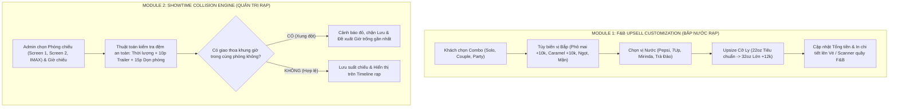

# KẾ HOẠCH TRIỂN KHAI: F&B UPSELL CUSTOMIZATION & SHOWTIME COLLISION ENGINE

> **Dự án:** CineMax AI - Smart Movie Ticket Booking Platform  
> **Mục tiêu:** Nâng cấp trải nghiệm bắp nước chuẩn rạp thương mại (CGV, Galaxy, Beta) và thuật toán quản trị lịch chiếu rạp chống trùng phòng chiếu.

---

## 1. TỔNG QUAN HAI MODULE CẦN TRIỂN KHAI



---

## 2. CHI TIẾT MODULE A: F&B UPSELL CUSTOMIZATION ENGINE

### 2.1. Vấn đề thực tế tại rạp chiếu phim
* Trong thực tế, hơn 50% doanh thu và 70% lợi nhuận của rạp đến từ quầy Concession (Bắp & Nước).
* Hiện tại web chỉ cho chọn số lượng combo phẳng (`combos: Record<string, number>`), không cho chọn vị bắp hay size nước.
* Khách hàng ra rạp nhận vé không biết bắp vị gì, nhân viên quầy Concession phải hỏi lại từng khách, làm chậm tốc độ phục vụ.

### 2.2. Thiết kế Data Structure (`src/types/index.ts`)
```typescript
export type PopcornFlavor = "sweet" | "caramel" | "cheese" | "salted";
export type DrinkType = "pepsi" | "7up" | "mirinda" | "peach_tea";
export type DrinkSize = "regular" | "large"; // regular: 22oz (+0đ), large: 32oz (+12.000đ)

export interface SelectedComboItem {
  id: string; // combo-beta-solo, combo-beta-couple, etc.
  name: string;
  quantity: number;
  basePrice: number;
  popcornFlavors: PopcornFlavor[]; // 1 vị cho solo, 2 vị cho couple 2 ngăn
  drinks: Array<{
    type: DrinkType;
    size: DrinkSize;
  }>;
  extraPrice: number; // Tiền phụ thu vị phô mai/caramel + upsize ly
  totalPrice: number;
}
```

### 2.3. Trải nghiệm người dùng tại Bước 3 (`BookingModal.tsx`)
1. **Interactive Combo Configurator:**
   * Mỗi khi bấm `+` thêm combo, hiển thị bảng tùy chỉnh trực quan:
     * **Chọn Vị Bắp:** Bắp Ngọt (0đ), Bắp Mặn (0đ), Bắp Phô Mai (+10.000đ), Bắp Caramel (+10.000đ). Với combo 2 ngăn (Couple), cho phép chọn 2 vị riêng biệt.
     * **Chọn Vị Nước:** Pepsi, 7Up, Mirinda Cam, Trà Đào.
     * **Nút gạt Upsize:** Nâng cấp lên ly khổng lồ 32oz (+12.000đ/ly).
2. **Tóm tắt đơn hàng thời gian thực:**
   * Hiển thị rõ: `1x Combo Beta Solo [Bắp Phô Mai, Pepsi Lớn 32oz] - 81.000đ`.
3. **Hiển thị trên Vé Điện Tử & Quầy Soát Vé (`/scanner`):**
   * Vé điện tử in rõ thông tin F&B để khách xuống quầy Bar lấy bắp nước không cần khai báo lại.

---

## 3. CHI TIẾT MODULE B: SHOWTIME COLLISION DETECTION ENGINE

### 3.1. Quy chuẩn Vận hành Suất chiếu Rạp Chiếu Phim
Một phòng chiếu sau khi kết thúc một bộ phim **không thể chiếu ngay phim tiếp theo lập tức**. Cần có 2 khoảng thời gian đệm bắt buộc:
1. **Đệm Trailer & Quảng cáo đầu giờ:** $10\text{ phút}$ (chiếu trailer phim mới, quảng cáo thương mại, nội quy an toàn).
2. **Đệm Dọn dẹp Vệ sinh & Thoát hiểm cuối giờ:** $15\text{ phút}$ (khán giả ra khỏi phòng, nhân viên dọn vỏ bắp/cốc nước, khử khuẩn, kiểm tra hệ thống máy chiếu/âm thanh).

$$\text{Tổng thời gian chiếm dụng phòng} = \text{Thời lượng phim (phút)} + 25\text{ phút}$$

### 3.2. Thuật toán Kiểm tra Xung đột (`src/lib/showtimeCollision.ts`)
```typescript
export interface ExistingShowtime {
  id: string;
  movieTitle: string;
  roomName: string;
  date: string;
  startTime: string; // HH:mm
  durationMinutes: number;
}

export interface CollisionCheckResult {
  hasConflict: boolean;
  conflictDetails?: {
    conflictingMovie: string;
    conflictingRange: string; // vd: 18:30 - 21:00 (bao gồm 25p dọn rạp & trailer)
    recommendedSlot?: string; // Khung giờ trống sớm nhất
  };
}
```

### 3.3. Tích hợp Giao diện Quản trị Rạp (`src/app/admin/page.tsx`)
1. **Form Thêm/Sửa Suất Chiếu Thông Minh:**
   * Tự động tính toán giờ kết thúc và giờ dọn phòng xong khi Admin nhập giờ bắt đầu.
   * Nếu chọn giờ chiếu đè lên khoảng bận của suất trước trong cùng phòng chiếu:
     * Cảnh báo màu đỏ nổi bật: `⚠️ XUNG ĐỘT PHÒNG CHIẾU: Phòng Beta 01 đang chiếu "Dune 2" từ 18:30 đến 21:00 (đã gồm 25p dọn rạp/trailer). Giờ sớm nhất có thể chiếu: 21:05`.
     * Nút **"Áp dụng giờ đề xuất (21:05)"** tự động sửa giờ chỉ với 1-click.
2. **Timeline Trực quan Suất Chiếu theo Phòng (Cinema Schedule Timeline):**
   * Thanh tiến trình 24 giờ cho từng phòng (`Phòng 01`, `Phòng 02`, `Phòng IMAX`), hiển thị các khối phim đang chiếm sóng và các khoảng trống (gap) khả dụng.

---

## 4. KẾ HOẠCH BƯỚC ĐI CỤ THỂ (SPRINT EXECUTION)

| Bước | Nhiệm vụ | File liên quan | Tiêu chí nghiệm thu |
| :--- | :--- | :--- | :--- |
| **Bước 1** | Mở rộng kiểu dữ liệu F&B và Bảng giá vị bắp/ly nước | `src/types/index.ts`, `src/lib/mockData.ts` | Type-safe đầy đủ các vị bắp, loại nước, phụ thu. |
| **Bước 2** | Nâng cấp UI Bước 3 chọn bắp nước có tùy biến vị & cỡ ly | `src/components/BookingModal.tsx` | Khách chọn được vị bắp, cỡ ly, tính đúng tổng tiền vé + combo. |
| **Bước 3** | Cập nhật Vé Điện Tử & Quầy Soát Vé hiển thị F&B | `src/components/MyTicketsModal.tsx`, `src/app/scanner/page.tsx` | Vé hiển thị chi tiết option F&B đã mua. |
| **Bước 4** | Xây dựng thuật toán chống trùng lịch chiếu rạp | `src/lib/showtimeCollision.ts` | Phát hiện chính xác giao thoa khung giờ có tính đệm 25 phút. |
| **Bước 5** | Tích hợp Collision Engine & Timeline vào Admin Portal | `src/app/admin/page.tsx` | Admin không thể tạo suất chiếu trùng; có gợi ý giờ trống kế tiếp. |
| **Bước 6** | Kiểm thử toàn diện & Build verification | `npm run build` | 100% routes sạch lỗi, test luồng thực tế mượt mà. |
