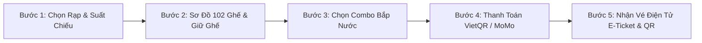

# 🎬 TỔNG QUAN SẢN PHẨM: TRANG WEB BÁN VÉ XEM PHIM CINEMAX AI
> **Sản phẩm**: Nền Tảng Mua Vé Xem Phim Chuẩn Beta Cinemas & Trợ Lý Ảo Điện Ảnh  
> **Thư mục**: `gđđ/` (Tài liệu Giai Đoạn Đầu)  
> **Công nghệ**: Next.js 14 App Router, TypeScript, Tailwind CSS (Luxury Navy/Gold), Upstash Redis  
> **Repository GitHub**: [https://github.com/nguyenchidung2007real-hue/cinecode](https://github.com/nguyenchidung2007real-hue/cinecode)

---

## 1. GIỚI THIỆU SẢN PHẨM
**CineMax AI** là website bán vé xem phim thế hệ mới kết hợp giữa trải nghiệm khám phá phim trực quan (chuẩn Netflix/IMDb), quy trình đặt vé rạp chuẩn xác không chồng chéo (Beta Cinemas) và Trợ lý AI phân tích cảm xúc phản hồi siêu tốc (~500 tokens/giây).

---

## 2. QUY TRÌNH ĐẶT VÉ RẠP 5 BƯỚC (BOOKING ENGINE WORKFLOW)

Quy trình mua vé trên website được tối ưu hóa toàn diện theo 5 bước rõ ràng:

### Chi tiết 5 Bước:
1. **Bước 1 — Chọn Cụm Rạp & Suất Chiếu**:
   - Chọn rạp rạp mục tiêu (mặc định: **Beta Cinemas Xuân Thủy**).
   - Lọc suất chiếu theo ngày (Hôm nay, Ngày mai) và định dạng (2D Phụ Đề, 2D Lồng Tiếng, IMAX).
   - Cơ chế phát hiện va chạm tự động (Collision Engine): Các suất chiếu được đệm 10 phút chiếu trailer và 15 phút dọn dẹp vệ sinh phòng chiếu.
2. **Bước 2 — Sơ Đồ 102 Ghế Động & Cơ Chế Giữ Ghế An Toàn (Seat Map)**:
   - Sơ đồ rạp 102 ghế chuẩn Beta: Hàng A–H (ghế đơn: Standard 55k, VIP 75k ở hàng E, F), Hàng K (ghế đôi Sweetbox 130k).
   - Màn hình cong rạp chiếu phát sáng (Cinema Screen Glow) tạo cảm giác không gian 3D.
   - **Giữ ghế tức thì (Seat Hold)**: Đếm ngược 5 phút trong khi khách thanh toán. Được khóa cứng bởi Redis Lua Script, chống bán trùng ghế (Overbooking).
   - **Chống ghế mồ côi (Orphan Seat Rule)**: Ngăn khách hàng chọn ghế chừa lại 1 ghế trống đơn độc không bán được.
   - **Gợi ý ghế AI (Seat Recommender)**: Tự động đánh dấu vị trí xem đẹp nhất (Sweet Spot) ở giữa phòng chiếu.
3. **Bước 3 — Tùy Biến Combo Bắp Nước (F&B Customization)**:
   - Danh mục bắp nước chính hãng rạp Beta Cinemas.
   - Combo Beta Solo: 1 bắp (chọn vị ngọt, phô mai +10k, caramel +10k) + 1 nước ngọt (có tùy chọn upsize trà đào).
   - Combo Beta Couple: Bắp 2 ngăn tùy biến 2 vị độc lập + 2 nước ngọt tiêu chuẩn.
4. **Bước 4 — Thanh Toán Nhanh Không Tiền Mặt (QR Payment)**:
   - Tự động sinh mã VietQR chuẩn ngân hàng và mã MoMo với số tiền chính xác từng đồng.
   - Nút xác nhận thanh toán an toàn, bảo vệ dữ liệu với cơ chế Replay Idempotency (ngăn thanh toán lặp khi bấm 2 lần).
5. **Bước 5 — Xuất Vé Điện Tử E-Ticket (Anti-Fraud Ticket)**:
   - Xuất vé ngay với mã QR được ký số bảo mật **HMAC-SHA256**.
   - Lưu trữ tự động vào **Ví Vé Của Tôi** trên trình duyệt, có thể xem lại bất cứ lúc nào mà không cần mạng.

---

## 3. CÁC TÍNH NĂNG VƯỢT TRỘI KHÁC TRÊN WEBSITE

### 3.1. Trợ Lý AI Tư Vấn Phim & Đặt Vé Nhanh (CineBot)
- Tích hợp chip xử lý siêu tốc Groq LPU, sinh từ tức thì (< 200ms).
- Hiểu ngôn ngữ tự nhiên: Nhận diện tâm trạng khách hàng (mệt mỏi, thất tình, hẹn hò, vui vẻ), tự động phân tích số người đi cùng (1 vé hay 2 vé).
- Cung cấp nút **"Đặt Vé Nhanh"** giúp khách bấm 1 chạm là vào thẳng suất chiếu phù hợp mà không cần tìm kiếm thủ công.

### 3.2. Hệ Thống Quản Trị & Soát Vé Tại Cửa Rạp
- **Trang Dashboard Doanh Thu (`/dashboard`)**: Theo dõi tỷ lệ lấp đầy ghế theo thời gian thực, doanh thu vé và bắp nước.
- **Trang Quản Trị Admin (`/admin`)**: Quản lý lịch chiếu phim, ma trận phòng chiếu không xung đột.
- **Máy Quét Mã QR Cửa Rạp (`/api/tickets/check-in`)**: Dành cho nhân viên soát vé tại cửa rạp. Ngăn chặn triệt để vé giả mạo và vé đã sử dụng qua lệnh nguyên tử `SETNX`.

### 3.3. Thiết Kế Giao Diện Sang Trọng (Luxury Navy & Gold)
- Nền xanh Navy sâu thẳm (`#070b14`), bề mặt thẻ phim `#0f1826`, viền `#25324a`.
- Màu điểm nhấn Vàng đồng hoàng gia (`#c9a227`) trên các nút kêu gọi hành động (CTA), tạo cảm giác cao cấp, lịch lãm, loại bỏ hoàn toàn ánh sáng chói mắt của phong cách neon cũ.

---

## 4. BẢNG GIÁ VÉ & F&B NIÊM YẾT

| Hạng mục | Quy cách | Giá niêm yết (VNĐ) | Ghi chú |
| :--- | :--- | :--- | :--- |
| **Ghế Standard** | Hàng A, B, C, D | **55.000 đ** | Hàng ghế đầu, góc nhìn rộng |
| **Ghế VIP** | Hàng E, F, G, H | **75.000 đ** | Vị trí trung tâm (Sweet spot), âm thanh chuẩn nhất |
| **Ghế Đôi Sweetbox** | Hàng K (K1 đến K6) | **130.000 đ** | Ghế sofa đôi dành cho 2 người, rộng rãi và riêng tư |
| **Combo Beta Solo** | 1 Bắp tiêu chuẩn + 1 Nước | **65.000 đ** | Đổi bắp phô mai/caramel: +10.000 đ |
| **Combo Beta Couple** | 1 Bắp 2 ngăn + 2 Nước ngọt | **95.000 đ** | Tùy biến 2 vị bắp độc lập |

---

## 5. CHỨNG NHẬN ĐẢM BẢO CHẤT LƯỢNG (TEST SUITE)
Hệ thống web bán vé đã vượt qua **37/37 kịch bản kiểm thử tự động (100% Passed)** trên toàn bộ 6 module cốt lõi:
- **Module 1**: Sơ đồ 102 ghế chuẩn Beta & Tính toán giá vé + F&B chống gian lận.
- **Module 2**: Động cơ phát hiện xung đột và va chạm lịch chiếu (Collision Engine).
- **Module 3**: Giữ ghế nguyên tử, chống Overbooking 50 request song song, trần 15 phút.
- **Module 4**: Thuật toán chặn ghế mồ côi (Orphan Seat Rule) và Gợi ý ghế AI.
- **Module 5**: Ký số HMAC-SHA256 mã QR, State machine vé và chống quét vé kép.
- **Module 6**: Bóc tách cảm xúc tiếng Việt (Mood Detection) và Trợ lý CineBot.
