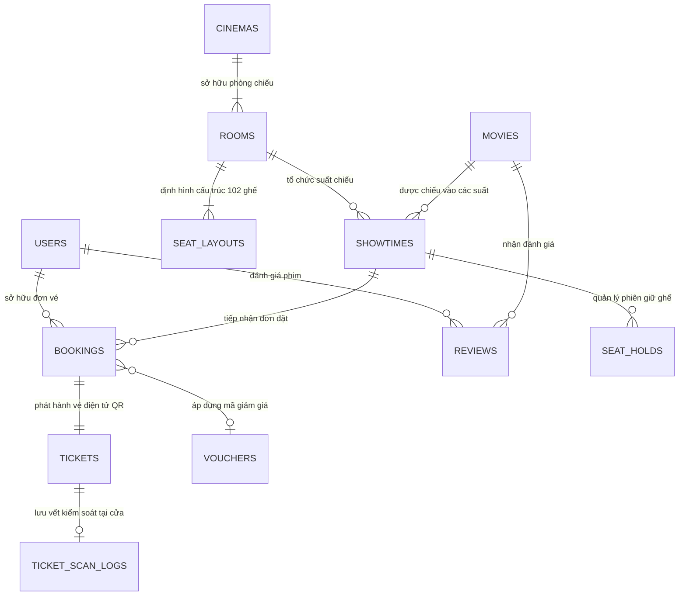
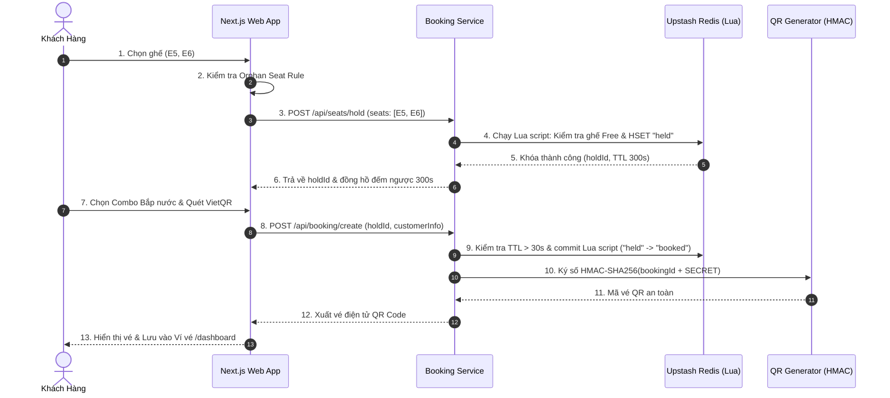

# 🎬 CINEMAX AI — BÁO CÁO ĐẶC TẢ DỰ ÁN, KHẢO SÁT CHỨC NĂNG & THIẾT KẾ CƠ SỞ DỮ LIỆU CHI TIẾT
> **Hệ Thống Đặt Vé Xem Phim Trực Tuyến Tích Hợp AI & Quản Trị Cụm Rạp Chiếu**  
> *Định dạng chuẩn theo Bảng phân rã WBS/SRS và Từ điển dữ liệu Data Dictionary*

---

## 📌 TRANG 1: THÔNG TIN DỰ ÁN & PHÂN CÔNG NHIỆM VỤ

### 1.1. Thông Tin Tổng Quan
* **Tên dự án:** Hệ Thống Đặt Vé Xem Phim Thông Minh & Quản Trị Cụm Rạp (CineMax AI)
* **Mã dự án:** `CINEMAX-AI-2026`
* **Mô hình triển khai:** Agile / Scrum (Sprints 1-4)
* **Đối tượng phục vụ:**
  1. **Khách hàng (Customer):** Mua vé xem phim, chọn ghế trực quan 3D, mua bắp nước F&B, nhận vé QR code.
  2. **Nhân viên soát vé (Staff):** Quét mã QR tại cửa phòng chiếu, xác thực vé chống giả, chống quét trùng.
  3. **Quản trị viên (Admin):** Quản lý lịch chiếu (chống trùng lịch phòng), quản lý rạp, giá vé, bắp nước, thống kê doanh thu.
* **Ngăn xếp công nghệ (Technology Stack):**
  * **Frontend:** Next.js 14 (App Router), React 18, TypeScript, Tailwind CSS, Lucide Icons, Canvas 3D.
  * **Backend API:** Next.js Route Handlers (Serverless Architecture), Node.js Crypto (HMAC-SHA256, timingSafeEqual).
  * **Cơ sở dữ liệu & Caching:** Upstash Redis REST KV (Distributed Mutex Locks, Atomic Lua Scripts, Sets, Hashes).
  * **AI & Dịch vụ ngoài:** Groq AI LPU (Llama 3.3 70B NLP ~500 tokens/s), Hugging Face Semantic Search RAG, TMDB API v3, VietQR Napas 247.

---

### 1.2. Danh Sách Thành Viên & Phân Công Trách Nhiệm
*(Dự án được thực hiện bởi 4 thành viên chủ chốt, loại trừ Đặng Quốc Toản theo đúng phân bổ)*

| STT | Họ và Tên | Vai Trò / Vị Trí | Phân Hệ Phụ Trách | Nhiệm Vụ Cụ Thể Trong Dự Án | Ghi Chú |
| :-: | :--- | :--- | :--- | :--- | :-: |
| **1** | **Nguyễn Chí Dũng** | **Trưởng Nhóm / Fullstack Lead & AI Integration** | **Toàn hệ thống & AI Engine** | Quản lý kho mã nguồn (Git Repo), thiết kế kiến trúc tổng thể, tích hợp TMDB API & Groq AI Chatbot, xây dựng Semantic Search RAG, phát triển thanh Đặt vé nhanh 1-Click và tối ưu hóa UI/UX Booking Modal. | **Leader** |
| **2** | **Nguyễn Hải Đăng** | **Database Architect & Backend Engineer** | **Cơ Sở Dữ Liệu & Concurrency** | Thiết kế cấu trúc CSDL phân tán Upstash Redis (Hash, Set, Key patterns), viết các kịch bản Lua Scripts giữ ghế nguyên tử (hold/commit), thiết lập khóa phân tán (Distributed Mutex) chống Overbooking và Race Conditions. | Thành viên |
| **3** | **Nguyễn Văn Tuấn** | **Backend Services & Business Logic Engineer** | **Engine Nghiệp Vụ & Báo Cáo** | Xây dựng Showtime Collision Engine (thuật toán chống đè lịch chiếu phòng), thiết kế Orphan Seat Rule (chống ghế mồ côi), Module F&B Upsell & Pricing Engine, phát triển API Thống kê doanh thu rạp. | Thành viên |
| **4** | **Đào Duy Minh** | **Frontend Lead & Security Engineer** | **Giao Diện, Auth & Scanner** | Xây dựng Cổng Quản trị Admin (`/admin`), Cổng Nhân viên Soát vé (`/scanner`), cơ chế bảo mật vé chữ ký số HMAC-SHA256, xác thực phiên Admin HttpOnly Cookie và phân quyền nhân viên theo mã riêng biệt. | Thành viên |

---

## 📊 TRANG 2: BẢNG KHẢO SÁT CHỨC NĂNG & PHÂN QUYỀN (WBS & SRS MATRIX)

```mermaid
graph TD
    Root["CineMax AI System"] --> ADM["1. Phân Hệ Quản Trị (Admin)"]
    Root --> STF["2. Phân Hệ Nhân Viên (Staff)"]
    Root --> CUS["3. Phân Hệ Khách Hàng (Customer)"]
    
    ADM --> A1["Xác thực Admin & Session Cookie"]
    ADM --> A2["Quản lý Suất Chiếu & Collision Engine"]
    ADM --> A3["Quản lý Phim & Đồng bộ Beta Cinemas"]
    ADM --> A4["Quản lý Đơn vé & F&B Combos"]
    ADM --> A5["Quản lý Voucher & Dashboard Doanh Thu"]
    
    STF --> S1["Đăng nhập mã nhân viên (Staff ID)"]
    STF --> S2["Camera quét mã QR soát vé"]
    STF --> S3["Xác thực chữ ký HMAC chống vé giả"]
    STF --> S4["Chống quét trùng vé (Anti-Replay)"]
    STF --> S5["Tra cứu vé thủ công theo SĐT"]
    
    CUS --> C1["Trang chủ chuẩn thương mại (Now Playing, Upcoming)"]
    CUS --> C2["Tìm kiếm AI Spotlight & CineBot AI"]
    CUS --> C3["Thanh đặt vé nhanh 1-Click"]
    CUS --> C4["Sơ đồ 102 ghế chuẩn Beta & Chống ghế mồ côi"]
    CUS --> C5["Mô phỏng góc nhìn rạp 3D (View from seat)"]
    CUS --> C6["Giữ ghế nguyên tử 300s & F&B Upsell"]
    CUS --> C7["Thanh toán VietQR & Xuất vé điện tử QR"]
    CUS --> C8["Ví vé cá nhân /dashboard"]
```

### 2.1. Ma Trận Chi Tiết Toàn Bộ Chức Năng Theo 3 Vai Trò

| Mã CN | Phân Quyền | Module Chức Năng | Tên Chức Năng | Mô Tả Luồng Xử Lý & Yêu Cầu Giao Diện | Quy Chuẩn Kỹ Thuật / Nghiệp Vụ | Người Phụ Trách | Trạng Thái |
| :--- | :--- | :--- | :--- | :--- | :--- | :--- | :---: |
| **ADM-01** | Admin | Xác Thực | Đăng nhập Admin | Form mật khẩu quản trị tại `/admin/login`. Khóa tạm 5p sau 8 lần sai. Cấp cookie phiên HMAC HttpOnly. | POST `/api/auth/admin-login`; biến `ADMIN_LOGIN_PASSWORD`. | Đào Duy Minh | ✅ Xong |
| **ADM-02** | Admin | Xác Thực | Đăng xuất Admin | Nút bấm Đăng xuất trên thanh tiêu đề Admin, xóa sạch cookie phiên và chuyển hướng về trang login. | POST `/api/auth/admin-logout`; Max-Age=0 cookie deletion. | Đào Duy Minh | ✅ Xong |
| **ADM-03** | Admin | Quản Lý Phim | Danh sách & Lọc phim | Bảng danh sách phim kèm poster, thể loại, thời lượng, độ tuổi. Phân trang 15/30/45, tìm kiếm và sắp xếp. | Phân trang, Search by title, Sort ngày tạo/giá. | Nguyễn Chí Dũng | ✅ Xong |
| **ADM-04** | Admin | Suất Chiếu | Tạo suất chiếu mới | Form chọn rạp, phòng, phim, ngày, giờ. Tự động chạy Collision Engine kiểm tra trùng lịch. | Tự động cộng 10p trailer + 15p dọn phòng; Báo lỗi 409 và gợi ý 3 giờ trống. | Nguyễn Văn Tuấn | ✅ Xong |
| **ADM-05** | Admin | Suất Chiếu | Xóa / Hủy suất chiếu | Nút xóa đơn lẻ hoặc hàng loạt. Hỗ trợ chuyển vào thùng rác Soft Delete để khôi phục khi cần. | DELETE `/api/admin/showtimes`; Thu hồi khóa phòng trong Redis. | Nguyễn Hải Đăng | ✅ Xong |
| **ADM-06** | Admin | Suất Chiếu | Đồng bộ Beta Cinemas | Nút 'Đồng bộ Beta' tự động crawl lịch chiếu chuẩn từ cụm rạp Beta Xuân Thủy và nạp vào hệ thống. | POST `/api/admin/sync-beta`; Header Authorization Bearer máy-máy. | Nguyễn Chí Dũng | ✅ Xong |
| **ADM-07** | Admin | Quản Lý Đơn Vé | Xem vé toàn hệ thống | Hiển thị bảng toàn bộ vé: Mã vé, Khách, SĐT, Phim, Suất, Ghế, Tiền, Trạng thái (valid, used, void). | Phân trang, lọc trạng thái vé, tìm kiếm theo SĐT hoặc mã vé. | Đào Duy Minh | ✅ Xong |
| **ADM-08** | Admin | F&B / Bắp Nước | Quản lý Combo & Giá | Cấu hình các gói Combo (Beta Solo, Couple, Party), giá bán lẻ, các vị bắp (ngọt, phô mai, caramel) và cỡ nước. | F&B Upsell Catalog; Chống gian lận số vị bắp vượt quá số ngăn. | Nguyễn Văn Tuấn | ✅ Xong |
| **ADM-09** | Admin | Khuyến Mãi | Quản lý Voucher | Tạo mã voucher (SINHVIEN20, BETA50K), thiết lập hạn mức giảm, giá trị đơn tối thiểu, số lượt dùng và hạn dùng. | Kiểm tra tính hợp lệ tại giỏ hàng; Soft delete; Thống kê lượt kích hoạt. | Nguyễn Văn Tuấn | ✅ Xong |
| **ADM-10** | Admin | Thống Kê | Dashboard Doanh Thu | Thẻ chỉ số KPI: Doanh thu, Số vé đã bán, Tỷ lệ lấp đầy ghế, Top 5 phim bán chạy. Biểu đồ theo ngày/tuần/tháng. | Aggregated Metrics từ Ticket Store; Phân loại theo cụm rạp. | Nguyễn Văn Tuấn | ✅ Xong |
| **STF-01** | Staff | Xác Thực | Đăng nhập Soát vé | Nhân viên nhập Mã nhân viên (Staff ID) và Mật khẩu (Passcode) tại màn hình `/scanner` để kích hoạt ca trực. | Biến môi trường `STAFF_ACCOUNTS` (MãNV:Passcode:HọTên); Server tự gán tên. | Đào Duy Minh | ✅ Xong |
| **STF-02** | Staff | Soát Vé | Quét mã QR Camera | Giao diện Camera điện thoại/laptop, tự động căn khung quét mã QR trên vé của khách mang đến rạp. | Tự động giải mã chuỗi `cinemax:ticket:bk-xxxx:HMAC_TOKEN`; Báo âm thanh. | Đào Duy Minh | ✅ Xong |
| **STF-03** | Staff | Soát Vé | Xác thực chữ ký HMAC | Server băm lại HMAC-SHA256(bookingId + secret) và dùng timingSafeEqual so sánh. Báo vé giả mạo nếu sai. | POST `/api/tickets/check-in`; Status chuyển từ 'valid' sang 'used'. | Đào Duy Minh | ✅ Xong |
| **STF-04** | Staff | Soát Vé | Chống quét trùng (Anti-Replay) | Nếu vé đã quét trước đó, màn hình cảnh báo đỏ rực: 'VÉ ĐÃ SỬ DỤNG' kèm thời gian quét và tên nhân viên soát trước. | Redis `SETNX cinemax:ticket:used:<id>` nguyên tử, chống tranh chấp cùng 1 giây. | Nguyễn Hải Đăng | ✅ Xong |
| **STF-05** | Staff | Tra Cứu Vé | Tra cứu vé thủ công | Ô nhập liệu cho phép nhân viên gõ Mã vé hoặc Số điện thoại để kiểm tra thông tin vé khi máy khách hết pin. | GET `/api/tickets/[id]`; Hiển thị số ghế, phòng chiếu, tên phim. | Đào Duy Minh | ✅ Xong |
| **CUS-01** | Customer | Khám Phá | Xem phim chuẩn rạp | Danh sách phim theo tab: Đang Chiếu, Sắp Chiếu, Suất Đặc Biệt. Tích hợp dữ liệu live từ TMDB + phim Việt. | GET `/api/movies?category=all`; Lọc theo thể loại, độ tuổi, tìm kiếm tên. | Nguyễn Chí Dũng | ✅ Xong |
| **CUS-02** | Customer | AI Hỗ Trợ | Spotlight Search (RAG) | Nhấn Ctrl+K mở Spotlight AI. Gõ câu hỏi tự nhiên (VD: 'phim hành động cháy nổ xem cùng bạn gái'). | Hugging Face Semantic Search RAG; So khớp ngữ nghĩa vector. | Nguyễn Chí Dũng | ✅ Xong |
| **CUS-03** | Customer | AI Hỗ Trợ | CineBot AI tư vấn cảm xúc | Chatbot góc màn hình. Trò chuyện về tâm trạng (stress, buồn, hẹn hò), AI phân tích và đề xuất phim kèm ghế chuẩn. | Groq LPU Llama 3.3 70B (~500 tokens/s); Trích xuất số lượng người xem. | Nguyễn Chí Dũng | ✅ Xong |
| **CUS-04** | Customer | Đặt Vé | Đặt Vé Nhanh 1-Click | Quick Booking Bar: Chọn Phim -> Chọn Cụm Rạp -> Chọn Ngày (0, 1, 2) -> Chọn Suất -> Nút 'MUA VÉ NGAY'. | Auto-select suất khả dụng; Truyền initialShowtimeId vào modal 1-click. | Nguyễn Chí Dũng | ✅ Xong |
| **CUS-05** | Customer | Đặt Vé | Modal Bước 1: Chọn Suất | Hiển thị cụm rạp, ngày chiếu, khung giờ chiếu. Tự động ẩn suất đã qua giờ; Tự động chọn suất kế tiếp. | Tự động chuyển Ngày mai nếu hôm nay hết suất; Nút Tiếp tục kích hoạt tức thì. | Nguyễn Chí Dũng | ✅ Xong |
| **CUS-06** | Customer | Chọn Ghế | Sơ đồ 102 ghế Beta | Ma trận ghế 9 hàng A-K x 12 cột. Phân tầng: Standard (55k), VIP (75k), Đôi Sweetbox (130k). Tối đa 8 ghế. | Trạng thái thời gian thực (Trống, Đang giữ, Đã bán); Phân tầng màu sắc. | Nguyễn Văn Tuấn | ✅ Xong |
| **CUS-07** | Customer | Chọn Ghế | Chống ghế mồ côi (Orphan) | Ngăn khách để trống 1 ghế đơn độc ở đầu hàng, cuối hàng hoặc kẹp giữa 2 người khác, tối ưu lấp đầy rạp. | Orphan Seat Rule: Cảnh báo đỏ tức thì và chặn bấm Tiếp tục nếu vi phạm. | Nguyễn Văn Tuấn | ✅ Xong |
| **CUS-08** | Customer | Chọn Ghế | Mô phỏng góc nhìn rạp 3D | Bấm vào ghế để xem mô phỏng góc nhìn thực tế lên màn chiếu từ vị trí hàng ghế đó (Sweet Spot hàng E, F). | Canvas 3D Projection Engine; Trải nghiệm tương tác sống động. | Nguyễn Chí Dũng | ✅ Xong |
| **CUS-09** | Customer | Giữ Ghế | Giữ ghế nguyên tử 300s | Khóa các ghế đã chọn trong 300s với đồng hồ đếm ngược. Trong thời gian này người khác không thể chọn trùng. | POST `/api/seats/hold`; Redis Lua Script; Chống Overbooking tuyệt đối. | Nguyễn Hải Đăng | ✅ Xong |
| **CUS-10** | Customer | F&B / Bắp Nước | Tùy biến vị bắp & Upsize | Chọn combo: Tùy biến vị (Ngọt, Phô mai +10k, Caramel +10k) theo số ngăn và Upsize ly khổng lồ 32oz (+12k). | Catalog Concession Combos; Tự động tính toán phụ phí minh bạch. | Nguyễn Văn Tuấn | ✅ Xong |
| **CUS-11** | Customer | Thanh Toán | Thanh toán VietQR & MoMo | Tạo mã VietQR động chứa chính xác số tiền, số tài khoản và nội dung mã vé. Mở app ngân hàng quét 1 giây. | Chuẩn Napas 247 VietQR; Nút copy nhanh STK & nội dung thanh toán. | Nguyễn Chí Dũng | ✅ Xong |
| **CUS-12** | Customer | Vé Điện Tử | Xuất vé QR Code HMAC | Render vé điện tử hiển thị mã QR chống vé giả, số ghế, phòng chiếu, hướng dẫn vào rạp và nút Tải vé về máy. | Thư viện qrcode; Token ký số HMAC; Lưu trữ vé vào ví khách hàng. | Đào Duy Minh | ✅ Xong |
| **CUS-13** | Customer | Ví Vé Của Tôi | Quản lý vé tại `/dashboard` | Trang Dashboard cá nhân bảo vệ bằng số điện thoại. Khách xem lại vé đã mua, xem mã QR để soát vé tại rạp. | Phone Gate Auth; Tra cứu vé bằng Replay Idempotency; Vé Chưa dùng/Đã dùng. | Đào Duy Minh | ✅ Xong |

---

## 🗄️ TRANG 3: THIẾT KẾ CƠ SỞ DỮ LIỆU CHI TIẾT (DATA DICTIONARY & ERD)

### 3.1. Sơ Đồ Thực Thể Mối Quan Hệ (Logical Entity Relationship Diagram)

---

### 3.2. Từ Điển Dữ Liệu Chi Tiết (Data Dictionary)

#### Bảng 1: `users` (Tài khoản người dùng, nhân viên và quản trị)
| Tên Cột (Field) | Kiểu Dữ Liệu | Kích Thước | Khóa (Key) | Null? | Mặc Định | Mô Tả Nghiệp Vụ & Ràng Buộc |
| :--- | :--- | :---: | :---: | :---: | :---: | :--- |
| `id` | VARCHAR | 36 | **PK** | No | UUIDv4 | Mã định danh người dùng duy nhất |
| `full_name` | VARCHAR | 100 | | No | None | Họ và tên đầy đủ |
| `email` | VARCHAR | 150 | | Yes | None | Địa chỉ email liên hệ |
| `phone` | VARCHAR | 15 | **Unique** | No | None | Số điện thoại đăng nhập và tra cứu vé |
| `password_hash` | VARCHAR | 255 | | Yes | None | Mật khẩu băm an toàn (Admin / Staff) |
| `role` | TINYINT | 1 | | No | `0` | Phân quyền: `0=Customer`, `1=Staff`, `2=Admin` |
| `status` | VARCHAR | 20 | | No | `'active'` | Trạng thái: `active`, `locked`, `suspended` |
| `created_at` | TIMESTAMP | | | No | `NOW()` | Thời điểm tạo tài khoản |
| `updated_at` | TIMESTAMP | | | No | `NOW()` | Thời điểm cập nhật hồ sơ |
| `deleted_at` | TIMESTAMP | | | Yes | `NULL` | Thời điểm xóa mềm (Soft Delete) |

---

#### Bảng 2: `cinemas` (Danh mục cụm rạp)
| Tên Cột (Field) | Kiểu Dữ Liệu | Kích Thước | Khóa (Key) | Null? | Mặc Định | Mô Tả Nghiệp Vụ & Ràng Buộc |
| :--- | :--- | :---: | :---: | :---: | :---: | :--- |
| `id` | VARCHAR | 50 | **PK** | No | None | Mã rạp (VD: `beta-cinemas-xuan-thuy`) |
| `name` | VARCHAR | 150 | | No | None | Tên cụm rạp (VD: `Beta Cinemas Xuân Thủy`) |
| `address` | VARCHAR | 255 | | No | None | Địa chỉ thực tế của rạp |
| `city` | VARCHAR | 50 | | No | None | Tỉnh / Thành phố (Hà Nội, TP.HCM...) |
| `status` | VARCHAR | 20 | | No | `'active'` | Trạng thái hoạt động: `active`, `maintenance` |
| `created_at` | TIMESTAMP | | | No | `NOW()` | Ngày thêm rạp vào hệ thống |

---

#### Bảng 3: `rooms` (Phòng chiếu phim)
| Tên Cột (Field) | Kiểu Dữ Liệu | Kích Thước | Khóa (Key) | Null? | Mặc Định | Mô Tả Nghiệp Vụ & Ràng Buộc |
| :--- | :--- | :---: | :---: | :---: | :---: | :--- |
| `id` | VARCHAR | 60 | **PK** | No | None | Mã phòng chiếu duy nhất |
| `cinema_id` | VARCHAR | 50 | **FK** | No | None | Tham chiếu `cinemas(id)` |
| `room_name` | VARCHAR | 100 | | No | None | Tên phòng (Phòng Beta 01 Dolby 7.1) |
| `total_seats` | INT | | | No | `102` | Tổng số ghế của phòng (chuẩn 102 ghế) |
| `room_type` | VARCHAR | 30 | | No | `'Standard'` | Định dạng: `Standard`, `IMAX Laser`, `ScreenX` |
| `status` | VARCHAR | 20 | | No | `'active'` | Trạng thái: `active`, `repair` |

---

#### Bảng 4: `movies` (Danh mục phim chiếu rạp)
| Tên Cột (Field) | Kiểu Dữ Liệu | Kích Thước | Khóa (Key) | Null? | Mặc Định | Mô Tả Nghiệp Vụ & Ràng Buộc |
| :--- | :--- | :---: | :---: | :---: | :---: | :--- |
| `id` | VARCHAR | 60 | **PK** | No | None | Mã phim (`dune-2`, `lat-mat-7`, `tmdb-939243`) |
| `title` | VARCHAR | 255 | | No | None | Tên phim phát hành tại Việt Nam |
| `original_title` | VARCHAR | 255 | | Yes | None | Tên phim gốc quốc tế |
| `overview` | TEXT | | | Yes | None | Nội dung tóm tắt phim |
| `poster_url` | VARCHAR | 500 | | Yes | None | Đường dẫn ảnh áp phích (Poster CDN) |
| `backdrop_url` | VARCHAR | 500 | | Yes | None | Đường dẫn ảnh bìa ngang (Backdrop CDN) |
| `duration_minutes` | INT | | | No | `120` | Thời lượng phim tính bằng phút |
| `release_date` | DATE | | | Yes | None | Ngày khởi chiếu chính thức |
| `age_rating` | VARCHAR | 10 | | No | `'T18'` | Độ tuổi: `P` (mọi lứa tuổi), `T13`, `T16`, `T18` |
| `status` | VARCHAR | 20 | | No | `'now_playing'` | Trạng thái: `now_playing`, `upcoming`, `trending` |
| `vote_average` | DECIMAL | 3,1 | | No | `0.0` | Điểm đánh giá trung bình (1-10) |
| `trailer_youtube_id`| VARCHAR | 30 | | Yes | None | Mã video trailer trên YouTube |

---

#### Bảng 5: `showtimes` (Suất chiếu phim)
| Tên Cột (Field) | Kiểu Dữ Liệu | Kích Thước | Khóa (Key) | Null? | Mặc Định | Mô Tả Nghiệp Vụ & Ràng Buộc |
| :--- | :--- | :---: | :---: | :---: | :---: | :--- |
| `id` | VARCHAR | 64 | **PK** | No | None | Mã suất chiếu (`st-beta-1`, `st-xxxx`) |
| `movie_id` | VARCHAR | 60 | **FK** | No | None | Tham chiếu `movies(id)` |
| `cinema_id` | VARCHAR | 50 | **FK** | No | None | Tham chiếu `cinemas(id)` |
| `room_name` | VARCHAR | 100 | | No | None | Tên phòng tổ chức chiếu phim |
| `show_date` | DATE | | | No | None | Ngày chiếu (YYYY-MM-DD theo giờ VN) |
| `show_time` | VARCHAR | 5 | | No | None | Giờ bắt đầu chiếu (HH:mm) |
| `format` | VARCHAR | 30 | | No | `'2D Phụ Đề'` | Định dạng: `2D Phụ Đề`, `2D Lồng Tiếng`, `IMAX`, `4DX` |
| `duration_minutes` | INT | | | No | `120` | Thời lượng phim (phục vụ tính va chạm) |
| `created_at` | TIMESTAMP | | | No | `NOW()` | Thời điểm tạo suất chiếu |
| `deleted_at` | TIMESTAMP | | | Yes | `NULL` | Thời điểm xóa mềm suất chiếu |

---

#### Bảng 6: `seat_layouts` (Cấu hình sơ đồ 102 ghế chuẩn Beta Cinemas)
| Tên Cột (Field) | Kiểu Dữ Liệu | Kích Thước | Khóa (Key) | Null? | Mặc Định | Mô Tả Nghiệp Vụ & Ràng Buộc |
| :--- | :--- | :---: | :---: | :---: | :---: | :--- |
| `seat_id` | VARCHAR | 5 | **PK** | No | None | Tên ghế (`A1`..`H12`, `K1`..`K6`) |
| `row_label` | VARCHAR | 2 | | No | None | Hàng ghế: `A, B, C, D, E, F, G, H, K` (bỏ J) |
| `seat_number` | TINYINT | | | No | None | Số thứ tự ghế trong hàng (1 đến 12) |
| `seat_tier` | VARCHAR | 20 | | No | `'standard'` | Phân tầng: `standard` (55k), `vip` (75k), `couple` (130k) |
| `is_sweet_spot` | BOOLEAN | | | No | `FALSE` | Đánh dấu ghế vị trí vàng trung tâm (Hàng E, F) |

---

#### Bảng 7: `seat_holds` (Phiên giữ ghế tạm thời - Redis TTL 300s)
*Vật lý lưu trữ tại Redis Hash/Key: `cinemax:{showtimeId}:hold:{holdId}`*
| Tên Cột (Field) | Kiểu Dữ Liệu | Kích Thước | Khóa (Key) | Null? | Mặc Định | Mô Tả Nghiệp Vụ & Ràng Buộc |
| :--- | :--- | :---: | :---: | :---: | :---: | :--- |
| `hold_id` | VARCHAR | 32 | **PK** | No | None | Mã phiên giữ ghế (CSPRNG 16-byte hex) |
| `showtime_id` | VARCHAR | 64 | **FK** | No | None | Suất chiếu đang thao tác giữ ghế |
| `seats_json` | TEXT | | | No | None | Mảng danh sách ghế đang giữ: `["E5", "E6"]` |
| `created_at` | BIGINT | | | No | None | Timestamp epoch ms lúc bắt đầu giữ ghế |
| `expires_at` | BIGINT | | | No | None | Timestamp epoch ms hết hạn (TTL 300s = 5 phút) |
| `client_ip` | VARCHAR | 45 | | Yes | None | Địa chỉ IP / User Agent phiên đặt vé |

---

#### Bảng 8: `bookings` (Đơn đặt vé & Giao dịch thanh toán)
| Tên Cột (Field) | Kiểu Dữ Liệu | Kích Thước | Khóa (Key) | Null? | Mặc Định | Mô Tả Nghiệp Vụ & Ràng Buộc |
| :--- | :--- | :---: | :---: | :---: | :---: | :--- |
| `booking_id` | VARCHAR | 32 | **PK** | No | None | Mã đơn đặt vé duy nhất (`bk-xxxxxxxx`) |
| `hold_id` | VARCHAR | 32 | | No | None | Mã phiên giữ ghế tương ứng (Idempotent Key) |
| `showtime_id` | VARCHAR | 64 | **FK** | No | None | Tham chiếu `showtimes(id)` |
| `customer_name` | VARCHAR | 150 | | No | None | Họ tên người mua vé |
| `customer_phone`| VARCHAR | 15 | | No | None | Số điện thoại nhận vé & đối soát |
| `customer_email`| VARCHAR | 150 | | Yes | None | Email nhận vé điện tử |
| `seats_summary` | VARCHAR | 100 | | No | None | Chuỗi tóm tắt ghế (VD: `"E5, E6"`) |
| `ticket_amount` | INT | | | No | `0` | Tiền vé xem phim (VNĐ) |
| `concession_amount`| INT | | | No | `0` | Tiền bắp nước F&B mua kèm (VNĐ) |
| `discount_amount`| INT | | | No | `0` | Số tiền được giảm giá qua voucher (VNĐ) |
| `total_amount` | INT | | | No | None | Tổng tiền thực tế cần thanh toán (VNĐ) |
| `payment_method`| VARCHAR | 20 | | No | `'vietqr'` | Phương thức: `'vietqr'`, `'momo'`, `'counter'` |
| `payment_status`| VARCHAR | 20 | | No | `'paid'` | Trạng thái: `unpaid`, `paid`, `refunded` |
| `created_at` | TIMESTAMP | | | No | `NOW()` | Thời điểm tạo đơn thành công |

---

#### Bảng 9: `tickets` (Vé điện tử & Mã QR soát vé)
| Tên Cột (Field) | Kiểu Dữ Liệu | Kích Thước | Khóa (Key) | Null? | Mặc Định | Mô Tả Nghiệp Vụ & Ràng Buộc |
| :--- | :--- | :---: | :---: | :---: | :---: | :--- |
| `booking_id` | VARCHAR | 32 | **PK, FK** | No | None | Tham chiếu `bookings(booking_id)` |
| `qr_token` | VARCHAR | 255 | | No | None | Chuỗi ký số HMAC-SHA256 chống làm giả vé |
| `ticket_status` | VARCHAR | 20 | | No | `'valid'` | Trạng thái: `pending`, `valid`, `used`, `void` |
| `scanned_at` | TIMESTAMP | | | Yes | `NULL` | Thời điểm nhân viên quét vé vào phòng chiếu |
| `scanned_by` | VARCHAR | 100 | | Yes | `NULL` | Tên hoặc Mã nhân viên thực hiện soát vé |
| `void_reason` | VARCHAR | 255 | | Yes | `NULL` | Lý do hủy vé nếu trạng thái là `void` |
| `created_at` | TIMESTAMP | | | No | `NOW()` | Thời điểm phát hành vé |

---

#### Bảng 10: `vouchers` (Mã giảm giá & Khuyến mãi)
| Tên Cột (Field) | Kiểu Dữ Liệu | Kích Thước | Khóa (Key) | Null? | Mặc Định | Mô Tả Nghiệp Vụ & Ràng Buộc |
| :--- | :--- | :---: | :---: | :---: | :---: | :--- |
| `code` | VARCHAR | 30 | **PK** | No | None | Mã ưu đãi (VD: `SINHVIEN20`, `BETA50K`) |
| `title` | VARCHAR | 150 | | No | None | Tên chương trình khuyến mãi |
| `discount_type` | VARCHAR | 10 | | No | `'percent'` | Loại giảm: `'percent'` hoặc `'fixed'` |
| `discount_value`| INT | | | No | None | Mức giảm (VD: `20` cho 20% hoặc `50000` VNĐ) |
| `min_order_value`| INT | | | No | `0` | Giá trị đơn tối thiểu để áp dụng (VNĐ) |
| `max_discount` | INT | | | Yes | `NULL` | Mức giảm tối đa nếu tính theo phần trăm |
| `usage_limit` | INT | | | No | `100` | Tổng lượt sử dụng tối đa của mã |
| `used_count` | INT | | | No | `0` | Số lượt đã được khách hàng sử dụng |
| `start_date` | DATE | | | No | None | Ngày bắt đầu áp dụng |
| `end_date` | DATE | | | No | None | Ngày kết thúc khuyến mãi |
| `status` | VARCHAR | 20 | | No | `'active'` | Trạng thái: `active`, `disabled`, `expired` |

---

#### Bảng 11: `reviews` (Đánh giá & Chấm điểm phim)
| Tên Cột (Field) | Kiểu Dữ Liệu | Kích Thước | Khóa (Key) | Null? | Mặc Định | Mô Tả Nghiệp Vụ & Ràng Buộc |
| :--- | :--- | :---: | :---: | :---: | :---: | :--- |
| `id` | VARCHAR | 36 | **PK** | No | UUIDv4 | Mã định danh bài đánh giá |
| `movie_id` | VARCHAR | 60 | **FK** | No | None | Tham chiếu `movies(id)` |
| `booking_id` | VARCHAR | 32 | **FK** | No | None | Tham chiếu `bookings` (Verified Buyer Review) |
| `customer_phone`| VARCHAR | 15 | | No | None | Số điện thoại người gửi nhận xét |
| `rating_stars` | TINYINT | | | No | `5` | Điểm đánh giá từ 1 đến 5 sao |
| `comment_text` | TEXT | | | Yes | None | Nội dung cảm nhận về phim |
| `status` | VARCHAR | 20 | | No | `'approved'` | Trạng thái: `pending`, `approved`, `hidden` |
| `created_at` | TIMESTAMP | | | No | `NOW()` | Thời điểm gửi nhận xét |

---

## ⚙️ TRANG 4: ĐẶC TẢ CÁC QUY TRÌNH NGHIỆP VỤ CỐT LÕI (CORE BUSINESS WORKFLOWS)

---

### Quy Trình 1: Đặt Vé & Giữ Ghế Nguyên Tử 300 Giây (Seat Hold & Overbooking Prevention)
1. **Bước 1 (Chọn ghế):** Khách hàng chọn tối đa 8 ghế trên sơ đồ 102 ghế. Hệ thống chạy thuật toán `Orphan Seat Rule` kiểm tra không được bỏ trống 1 ghế đơn độc.
2. **Bước 2 (Gửi yêu cầu giữ chỗ):** Client gọi API `POST /api/seats/hold`.
3. **Bước 3 (Thực thi Lua Script nguyên tử):** Redis chạy script Lua kiểm tra xem có ghế nào đang bị người khác giữ hoặc đã bán không. Nếu có dù chỉ 1 ghế -> Trả về `409 SEAT_TAKEN` ngay lập tức, không có tình trạng giữ dở dang một phần.
4. **Bước 4 (Cấp phiên giữ chỗ 300s):** Nếu tất cả ghế đều trống -> Chuyển trạng thái sang `held`, sinh mã `holdId` ngẫu nhiên 128-bit và đặt TTL 300 giây (5 phút). Đồng hồ đếm ngược trên giao diện bắt đầu chạy.
5. **Bước 5 (Thanh toán an toàn):** Khách quét mã VietQR. Hệ thống chỉ cho phép chốt vé khi thời hạn giữ ghế còn tối thiểu > 30 giây để tránh xung đột hết hạn ngay thời điểm trừ tiền.
6. **Bước 6 (Chốt ghế vĩnh viễn):** Khi thanh toán được xác nhận, Redis Lua script chuyển trạng thái ghế từ `held` sang `booked` vĩnh viễn và phát hành vé điện tử.

---

### Quy Trình 2: Soát Vé Điện Tử Tại Cửa Bằng Mã QR (Anti-Fraud QR Scanner)
1. **Bước 1 (Trình vé):** Khách hàng mở trang `/dashboard` trên điện thoại hiển thị mã QR của vé đã mua. Mã QR mã hóa chuỗi token: `cinemax:ticket:<bookingId>:<HMAC_SIGNATURE>`.
2. **Bước 2 (Quét mã):** Nhân viên rạp mở `/scanner` và dùng camera quét mã QR.
3. **Bước 3 (Xác thực chữ ký số):** Server nhận `bookingId` và chữ ký số, sử dụng khóa bí mật `TICKET_SIGNING_SECRET` băm lại mã vé bằng thuật toán `HMAC-SHA256`. Sử dụng hàm so sánh thời gian an toàn `crypto.timingSafeEqual` để đối chiếu, loại bỏ hoàn toàn nguy cơ tấn công Timing Attack. Nếu vé bị sửa đổi dù chỉ 1 ký tự -> Báo lỗi `403 INVALID_TOKEN` (Vé giả mạo).
4. **Bước 4 (Chống quét trùng Anti-Replay):** Thực thi lệnh Redis nguyên tử: `SET cinemax:ticket:used:<bookingId> <staffId> EX 2592000 NX`. Nếu lệnh trả về `0` (key đã tồn tại) -> Màn hình báo đỏ rực: **"VÉ ĐÃ QUA CỔNG SOÁT TRƯỚC ĐÓ"** kèm tên nhân viên và thời gian đã quét.
5. **Bước 5 (Cho phép vào phòng):** Nếu lệnh trả về `1` -> Màn hình chuyển xanh: **"VÉ HỢP LỆ"**, hiển thị chi tiết số ghế, phòng chiếu để nhân viên hướng dẫn khách vào rạp.

---

### Quy Trình 3: Xếp Lịch Chiếu & Kiểm Tra Va Chạm Phòng (Showtime Collision Detection)
1. **Bước 1 (Nhập thông tin suất chiếu):** Quản trị viên nhập thông tin suất chiếu: Cụm rạp, Phòng chiếu, Phim, Ngày chiếu và Giờ chiếu.
2. **Bước 2 (Tính toán khoảng thời gian chiếm dụng):** Hệ thống tính toán thời gian chiếm dụng phòng theo công thức vận hành rạp chiếu thực tế:
   $$\text{Khoảng chiếm dụng} = [\text{Giờ bắt đầu}, \text{Giờ bắt đầu} + \text{Thời lượng phim} + 10\text{p quảng cáo} + 15\text{p dọn dẹp vệ sinh})$$
3. **Bước 3 (So khớp va chạm):** Lấy toàn bộ các suất chiếu đã có trong phòng vào ngày đó và kiểm tra xung đột:
   * **Trường hợp 1 (Xung đột):** Nếu khung giờ bị đè hoặc phạm vào 15 phút dọn dẹp -> Hệ thống từ chối ghi và tự động tính toán trả về **3 khung giờ trống khả dụng gần nhất** để gợi ý cho Admin.
   * **Trường hợp 2 (Hợp lệ):** Hai suất chiếu khác phòng chiếu cùng một giờ được chấp thuận 100%. Suất chiếu kế tiếp được bắt đầu ngay khi kết thúc 15 phút dọn dẹp.
4. **Bước 4 (Khóa phân tán Distributed Mutex):** Sử dụng khóa phân tán `withLock(roomBucket)` để đảm bảo ngay cả khi 2 quản trị viên cùng bấm tạo suất chiếu vào cùng 1 phòng tại cùng 1 giây, các thao tác vẫn được xếp hàng tuần tự và không bao giờ bị ghi đè lịch.

---

### Quy Trình 4: Xử Lý Đổi Trả & Hủy Vé 6 Bước (Ticket Void & Refund Process)
1. **Bước 1 (Tiếp nhận khiếu nại):** Khách hàng yêu cầu hủy vé hoặc đổi suất (do sự cố bất khả kháng từ rạp) trước giờ chiếu tối thiểu 60 phút qua hotline/website, cung cấp mã đơn vé và số điện thoại.
2. **Bước 2 (Xác minh trạng thái vé):** Quản trị viên tra cứu vé trên hệ thống. Vé bắt buộc phải ở trạng thái `valid` (chưa từng quét qua cổng soát vé). Nếu vé đã chuyển sang `used` -> Từ chối hoàn tiền ngay lập tức.
3. **Bước 3 (Vô hiệu hóa vé - Void):** Quản trị viên bấm nút "Hủy vé" trên Admin Panel. Hệ thống cập nhật `ticket_status = 'void'`, ghi rõ `void_reason` và danh tính quản trị viên thực hiện.
4. **Bước 4 (Giải phóng ghế phòng chiếu):** Hệ thống xóa ghế tương ứng khỏi Redis Hash của suất chiếu, trả ghế về trạng thái `free` trên sơ đồ rạp để khách hàng khác có thể đặt lại ngay lập tức.
5. **Bước 5 (Chuyển tiền hoàn trả):** Kế toán rạp thực hiện lệnh hoàn tiền về số tài khoản / ví MoMo của khách hàng, cập nhật `bookings.payment_status = 'refunded'`.
6. **Bước 6 (Thông báo & Lưu vết Audit):** Gửi email/SMS thông báo hoàn tiền thành công cho khách hàng, đồng thời ghi vết toàn bộ sự kiện vào `activity_logs` để phục vụ đối soát kế toán cuối tháng.

---

## 📥 TẬP TIN EXCEL ĐÍNH KÈM
Toàn bộ nội dung trên đã được xuất thành bảng tính Excel chuyên nghiệp (4 Sheet đầy đủ định dạng, căn chỉnh cột và màu sắc tiêu chuẩn doanh nghiệp):
* **Đường dẫn tệp Excel:** [`CineMax_AI_KhaoSatChucNang_Database_ChiTiet.xlsx`](file:///c:/Users/NGUYEN%20CHI%20DUNG/OneDrive/Documents/web%20mua%20v%C3%A9%20xem%20phim/CineMax_AI_KhaoSatChucNang_Database_ChiTiet.xlsx)
