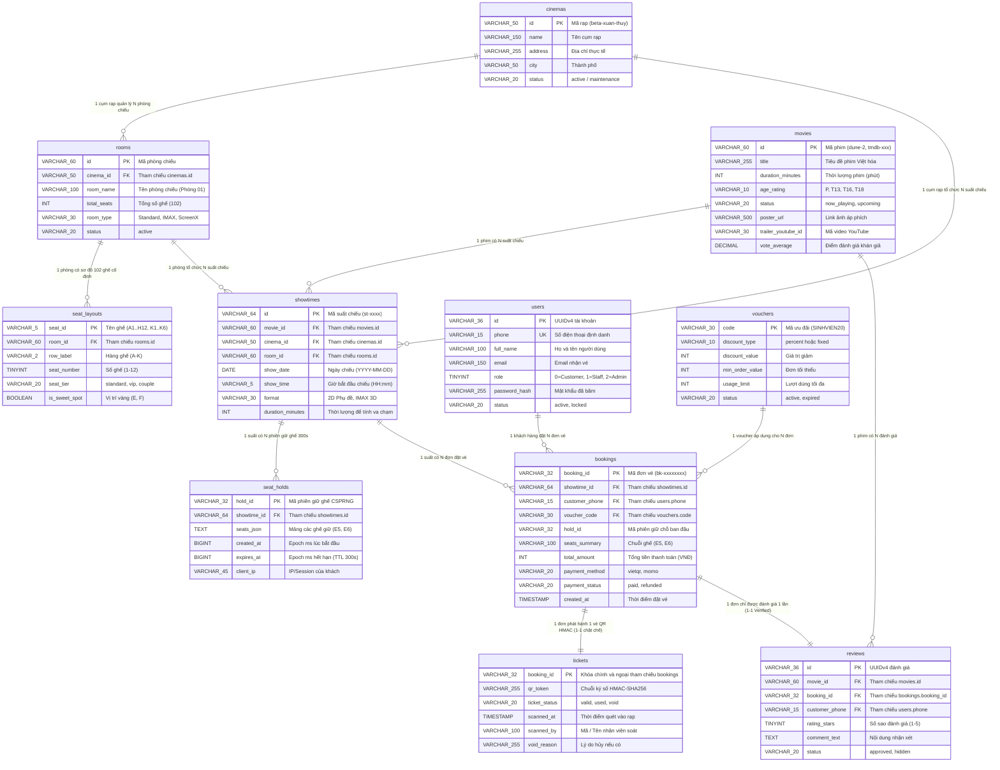

# BÁO CÁO KHẢO SÁT CHỨC NĂNG & THIẾT KẾ CƠ SỞ DỮ LIỆU CHI TIẾT
## DỰ ÁN: CINEMAX AI — HỆ THỐNG ĐẶT VÉ XEM PHIM TRỰC TUYẾN THÔNG MINH
**Mã dự án:** `CINEMAX-AI-2026`  
**Ngày cập nhật:** Tháng 10/2026  
**Đơn vị phát triển:** Nhóm CineMax AI (4 thành viên)

---

## 👥 I. DANH SÁCH THÀNH VIÊN & PHÂN CÔNG TRÁCH NHIỆM

> **Lưu ý nhân sự:** Dự án gồm 4 thành viên chủ chốt (Kế thừa từ Smart CV, **không bao gồm Đặng Quốc Toản**):

| STT | Tên viết tắt | Họ và Tên | Vai Trò / Vị Trí | Phân Hệ Phụ Trách & Trách Nhiệm Chi Tiết |
| :---: | :---: | :--- | :--- | :--- |
| 1 | **Dũng** | **Nguyễn Chí Dũng** | **Trưởng Nhóm / Fullstack Lead & AI** | Kiến trúc tổng thể hệ thống, tích hợp TMDB API & Groq LPU AI Chatbot, Semantic Search RAG, tối ưu hóa UI/UX Home & Booking Modal, module Phim & Đánh giá. |
| 2 | **Đăng** | **Nguyễn Hải Đăng** | **Database Architect & Backend** | Thiết kế lược đồ CSDL Upstash Redis & Relational Schema (11 bảng), kịch bản Redis Lua Script giữ ghế 300s nguyên tử, Distributed Mutex khóa phòng chiếu, thu hồi vé & ghế khi hủy suất. |
| 3 | **Tuấn** | **Nguyễn Văn Tuấn** | **Backend Services & Business Logic** | Thuật toán Showtime Collision Engine (chống va chạm lịch chiếu), Orphan Seat Rule (chống ghế mồ côi), F&B Upsell combo bắp nước, Module Voucher, Dashboard thống kê doanh thu. |
| 4 | **Minh** | **Đào Duy Minh** | **Frontend Lead, Auth & Scanner** | Cổng Quản trị Admin (/admin), Cổng soát vé camera nhân viên (/scanner), Xác thực HMAC-SHA256 chống vé giả & chống quét trùng (Anti-replay), Dashboard ví vé khách hàng (/dashboard). |

---

## 📊 II. SƠ ĐỒ QUAN HỆ CƠ SỞ DỮ LIỆU VỚI MŨI TÊN LIÊN KẾT (DATABASE ERD)

### 1. Sơ Đồ Thực Thể Quan Hệ (Mermaid ERD với Mũi Tên Chỉ Rõ Bản Số 1:N & 1:1)



---

### 2. Sơ Đồ Khối Luồng Dữ Liệu ASCII (Data Flow Architecture)

```
┌────────────────────────┐                   ┌────────────────────────┐                   ┌────────────────────────┐
│   cinemas (Cụm Rạp)    │──( 1 : N )───────►│  rooms (Phòng Chiếu)   │──( 1 : N )───────►│ seat_layouts (102 Ghế) │
│   PK: id               │                   │  PK: id, FK: cinema_id │                   │  PK: seat_id           │
└──────────┬─────────────┘                   └──────────┬─────────────┘                   │  FK: room_id           │
           │                                            │                                 └────────────────────────┘
        ( 1 : N )                                    ( 1 : N )
           │                                            │
           ▼                                            ▼
┌────────────────────────┐                   ┌────────────────────────┐                   ┌────────────────────────┐
│  movies (Phim Chiếu)   │──( 1 : N )───────►│ showtimes (Suất Chiếu) │──( 1 : N )───────►│ seat_holds (Giữ 300s)  │
│  PK: id                │                   │  PK: id                │                   │  PK: hold_id           │
└──────────┬─────────────┘                   │  FK: movie_id, room_id │                   │  FK: showtime_id       │
           │                                 └──────────┬─────────────┘                   └────────────────────────┘
           │                                            │
           │                                         ( 1 : N )
           │                                            │
           │    ┌────────────────────────┐              ▼
           │    │  users (Khách / Phone) │──( 1 : N )──►┌────────────────────────┐                   ┌────────────────────────┐
           │    │  PK: id, phone         │              │ bookings (Đơn Đặt Vé)  │──( 1 : 1 )───────►│  tickets (Mã QR HMAC)  │
           │    └────────────────────────┘              │  PK: booking_id        │  [CHẶT CHẼ]       │  PK,FK: booking_id     │
           │    ┌────────────────────────┐              │  FK: showtime_id, phone│                   │  qr_token (HMAC-SHA256)│
           │    │  vouchers (Khuyến Mãi) │──( 1 : N )──►│  FK: voucher_code      │                   └────────────────────────┘
           │    │  PK: code              │              └──────────┬─────────────┘
           │    └────────────────────────┘                         │
           │                                                    ( 1 : 1 ) [Verified Review]
        ( 1 : N )                                                  │
           │                                                       ▼
           └────────────────────────────────────────────►┌────────────────────────┐
                                                         │ reviews (Đánh Giá Phim)│
                                                         │  PK: id                │
                                                         │  FK: movie_id, booking │
                                                         └────────────────────────┘
```

---

### 3. Bảng Ánh Xạ Mối Quan Hệ Khóa Ngoại (Foreign Key Mapping Matrix)

| STT | Bảng Nguồn (Parent) | Khóa Chính (PK) | Bản Số | Mũi Tên Liên Kết | Bảng Đích (Child) | Khóa Ngoại (FK) | Ràng Buộc Toàn Vẹn | Ý Nghĩa Nghiệp Vụ Cốt Lõi |
| :---: | :--- | :--- | :---: | :---: | :--- | :--- | :---: | :--- |
| **1** | `cinemas` | `id` | **1 : N** | `────────(1 : N)────────►` | `rooms` | `cinema_id` | CASCADE | Một cụm rạp quản lý nhiều phòng chiếu (Standard, IMAX Laser, ScreenX). |
| **2** | `cinemas` | `id` | **1 : N** | `────────(1 : N)────────►` | `showtimes` | `cinema_id` | RESTRICT | Một cụm rạp tổ chức nhiều suất chiếu. Không được xóa rạp nếu đang có suất chiếu chưa chiếu. |
| **3** | `rooms` | `id` | **1 : N** | `────────(1 : N)────────►` | `seat_layouts` | `room_id` | CASCADE | Một phòng chiếu sở hữu cấu hình sơ đồ 102 ghế cố định (A1-H12, K1-K6). |
| **4** | `rooms` | `id` | **1 : N** | `────────(1 : N)────────►` | `showtimes` | `room_id` | RESTRICT | Một phòng chiếu tổ chức nhiều suất chiếu. Showtime Collision Engine kiểm tra không trùng giờ trên cùng 1 phòng. |
| **5** | `movies` | `id` | **1 : N** | `────────(1 : N)────────►` | `showtimes` | `movie_id` | RESTRICT | Một bộ phim được xếp lịch chiếu tại nhiều khung giờ và rạp khác nhau. Dùng duration_minutes để tính khoảng va chạm phòng. |
| **6** | `movies` | `id` | **1 : N** | `────────(1 : N)────────►` | `reviews` | `movie_id` | CASCADE | Một bộ phim nhận được nhiều nhận xét đánh giá từ khán giả. Xóa phim sẽ xóa các đánh giá liên quan. |
| **7** | `showtimes` | `id` | **1 : N** | `────────(1 : N)────────►` | `seat_holds` | `showtime_id` | CASCADE | Một suất chiếu có nhiều phiên giữ ghế tạm thời. Redis Key: `cinemax:{showtimeId}:hold:{holdId}` với TTL 300s. |
| **8** | `showtimes` | `id` | **1 : N** | `────────(1 : N)────────►` | `bookings` | `showtime_id` | RESTRICT | Một suất chiếu có nhiều đơn đặt vé đã thanh toán thành công. Không thể xóa suất chiếu nếu đã bán vé. |
| **9** | `users` | `id / phone` | **1 : N** | `────────(1 : N)────────►` | `bookings` | `customer_phone` | SET NULL | Một tài khoản người dùng / số điện thoại thực hiện nhiều đơn đặt vé. Dùng để xem lịch sử vé tại `/dashboard`. |
| **10** | `vouchers` | `code` | **1 : N** | `────────(1 : N)────────►` | `bookings` | `voucher_code` | SET NULL | Một mã khuyến mãi có thể được áp dụng cho nhiều đơn vé khác nhau cho đến khi hết hạn mức usage_limit. |
| **11** | `bookings` | `booking_id` | **1 : 1** | `────────(1 : 1)────────►` | `tickets` | `booking_id` | CASCADE | **Quan hệ 1-1 Chặt chẽ:** Mỗi đơn đặt vé phát hành DUY NHẤT 1 vé điện tử chứa chuỗi mã QR ký số HMAC-SHA256. |
| **12** | `bookings` | `booking_id` | **1 : 1** | `────────(1 : 1)────────►` | `reviews` | `booking_id` | SET NULL | **Quan hệ 1-1 Bảo mật:** Mỗi đơn vé chỉ được đánh giá phim 1 lần duy nhất (Verified Review chống đánh giá ảo). |

---

## 📑 III. TỪ ĐIỂN DỮ LIỆU CHI TIẾT 11 BẢNG (DATA DICTIONARY)

*(Chi tiết đầy đủ xem tại file [2_Database_CineMax_11_Bang.csv](file:///c:/Users/NGUYEN%20CHI%20DUNG/OneDrive/Documents/web%20mua%20v%C3%A9%20xem%20phim/kh%E1%BB%9Fi%20%C4%91%E1%BB%99ng/2_Database_CineMax_11_Bang.csv) hoặc sheet `DATABASE (11 BẢNG)` trên Google Sheets / Excel)*.

---

## 🔄 IV. ĐẶC TẢ 4 QUY TRÌNH NGHIỆP VỤ CỐT LÕI

1. **Quy trình 1: Đặt vé & Giữ ghế nguyên tử 300s (Seat Hold & Booking)**
   - Khách chọn ghế -> Gọi API `POST /api/seats/hold` -> Thực thi Redis Lua Script kiểm tra nguyên tử -> Khóa giữ ghế 300s -> Khách thanh toán VietQR -> Chuyển vé sang `valid` và ký số HMAC-SHA256 -> Giải phóng khóa giữ ghế sau 300s nếu quá hạn.

2. **Quy trình 2: Soát vé điện tử & Chống vé giả / Quét trùng (QR Check-in)**
   - Khách trình mã QR `cinemax:ticket:bookingId:token` -> Nhân viên quét bằng camera `/scanner` -> Server băm lại HMAC-SHA256(bookingId + secret) đối soát bằng `timingSafeEqual` -> Kiểm tra Redis `SETNX cinemax:ticket:used:<id>` -> Nếu vé đã quét trước đó: Báo động đỏ `VÉ ĐÃ SỬ DỤNG` -> Nếu hợp lệ: Báo xanh `VÉ HỢP LỆ — MỜI VÀO PHÒNG CHIẾU`.

3. **Quy trình 3: Điều phối lịch chiếu & Chống va chạm phòng chiếu (Showtime Collision Engine)**
   - Admin tạo suất chiếu -> Backend cộng 10p trailer + 15p dọn phòng -> Kiểm tra va chạm khoảng `[start, start + duration + 25p]` -> Nếu va chạm: Báo lỗi 409 Conflict và đề xuất 3 khung giờ trống gần nhất của phòng.

4. **Quy trình 4: Hoàn tiền & Hủy vé tự động (Refund Policy)**
   - Khách yêu cầu hoàn vé trên `/dashboard` trước giờ chiếu tối thiểu 60 phút -> Kiểm tra vé chưa bị quét (`valid`) -> Chuyển trạng thái vé sang `void`, giải phóng ghế về `free` trong phòng chiếu -> Hoàn tiền tự động qua VietQR/MoMo.
