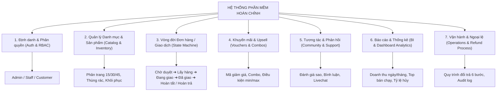
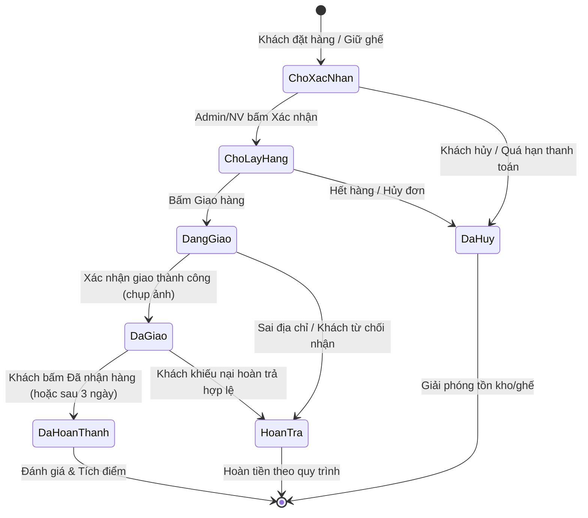

# 🚀 BỘ KHUNG CHUẨN BỊ DỰ ÁN PHẦN MỀM TOÀN DIỆN (PROJECT KICKOFF MASTER BLUEPRINT)
> *Đúc kết từ Bảng Phân rã Chức năng (WBS/SRS) & Thực tiễn triển khai Hệ thống Web Production*

---

## 📌 1. Vì Sao Chúng Ta Thường Quên Khi Bắt Đầu Dự Án?

Khi mới nảy ra ý tưởng hoặc nhận một đề tài dự án, tâm lý chung của lập trình viên là **chỉ tập trung vào "Happy Path"** (Khách vào -> Chọn đồ -> Bấm mua -> Thành công). 

Tuy nhiên, bảng tính Google Sheet của bạn đã thể hiện một bức tranh **chuẩn kỹ thuật phần mềm (Software Engineering)** mà một hệ thống thực tế bắt buộc phải có:
1. **Edge Cases (Trường hợp ngoại lệ):** Khách lừa, sai địa chỉ, hủy đơn, lỗi thanh toán, hoàn trả hàng/vé.
2. **Quản trị vòng đời dữ liệu (CRUD & Lifecycle):** Không chỉ thêm/xóa mà còn có **Thùng rác (Soft Delete)**, khôi phục, đổi trạng thái hàng loạt, phân trang `[15, 30, 45]`.
3. **Phân quyền đa tầng (RBAC - Role-Based Access Control):** Admin (Toàn quyền) - Nhân viên (Vận hành/Xử lý đơn/Chat) - Khách hàng (Trải nghiệm/Lịch sử/Đánh giá).
4. **Quy trình State Machine chặt chẽ:** Đơn hàng / Vé không thể nhảy trạng thái bừa bãi, mỗi bước đều có nút hành động và thông báo kèm minh chứng.
5. **Kinh doanh & Báo cáo (Business Intelligence):** Doanh thu, tồn kho, top bán chạy, tỷ lệ hoàn trả.

---

## 🏛️ 2. Mô Hình 7 Trụ Cột Cốt Lõi (Dùng Cho Mọi Dự Án Web)

---

## 📋 3. Chi Tiết Bảng Checklist Bắt Đầu Dự Án (Project Kickoff Checklist)

### Trụ Cột 1: Xác Thực & Phân Quyền (Authentication & RBAC)
- [ ] **Khách hàng (User/Customer - Role 0):**
  - Đăng ký qua Email (xác thực OTP / Verification Link).
  - Đăng nhập Email + Mật khẩu (tùy chọn Google / Facebook OAuth).
  - Quên mật khẩu (gửi mã OTP qua email, giới hạn thời gian 5 phút).
  - Quản lý hồ sơ cá nhân, đổi mật khẩu, sổ nhiều địa chỉ giao hàng.
- [ ] **Nhân viên (Staff - Role 1):**
  - Tài khoản do Admin cấp hoặc đăng nhập bằng Mã nhân viên riêng biệt.
  - Phân quyền chỉ thấy các tác vụ vận hành (soát vé, duyệt đơn, chat hỗ trợ, cập nhật trạng thái).
- [ ] **Quản trị viên (Admin - Role 2):**
  - Bảo vệ bằng Session HttpOnly Cookie chống XSS.
  - Có cơ chế chặn Brute Force (khóa tạm sau 5–8 lần nhập sai).
  - Tách biệt Secret hệ thống máy-máy (`ADMIN_SYNC_SECRET`) khỏi mật khẩu người dùng (`ADMIN_LOGIN_PASSWORD`).

---

### Trụ Cột 2: Quản Lý Hàng Hóa & Danh Mục (Catalog & Soft Delete)
- [ ] **Danh mục & Thuộc tính đa cấp:**
  - Danh mục cha / con.
  - Thuộc tính biến thể (Màu sắc, kích thước, cấu hình RAM/ROM, hoặc với phim: 2D, 3D, IMAX, Ghế VIP, Ghế Couple).
- [ ] **Tiêu chuẩn cho mọi bảng CRUD trong Admin:**
  - Phân trang linh hoạt (Cho người dùng chọn xem 15, 30, hoặc 45 dòng/trang).
  - Tìm kiếm tức thời (Search by name/code).
  - Bộ lọc kết hợp (Filter theo danh mục, trạng thái, khoảng giá).
  - Sắp xếp đa cột (Sort tăng/giảm theo ngày tạo, giá, tên, trạng thái).
  - Bật/tắt trạng thái nhanh (Toggle active/inactive).
  - **Cơ chế Thùng rác (Soft Delete):** Xóa không mất dữ liệu ngay mà chuyển vào Thùng rác (`deleted_at`), cho phép khôi phục đơn lẻ hoặc hàng loạt, xóa vĩnh viễn khi cần.

---

### Trụ Cột 3: Quản Lý Đơn Hàng Theo State Machine (Order / Booking Engine)
Một đơn hàng / giao dịch không được phép sửa tự do mà phải đi qua các trạng thái hữu hạn (State Transition):

---

### Trụ Cột 4: Khuyến Mãi, Mã Giảm Giá & Bán Kèm (Marketing & Upsell)
- [ ] **Quản lý Voucher:**
  - Mã code (ví dụ `CINEMA50`, `WELCOME`).
  - Loại giảm: Theo % hoặc số tiền cố định (VNĐ).
  - Điều kiện: Giá trị đơn hàng tối thiểu, mức giảm tối đa.
  - Giới hạn: Số lượt dùng tối đa, thời gian hiệu lực từ ngày... đến ngày...
- [ ] **Bán kèm (Upsell / Cross-sell):**
  - Mua kèm bắp nước, phụ kiện, combo quà tặng.
  - Khuyến nghị sản phẩm liên quan.

---

### Trụ Cột 5: Báo Cáo & Dashboard Thống Kê (Analytics & Business Intelligence)
- [ ] **Thống kê tổng quan (Real-time Metric Cards):**
  - Doanh thu hôm nay / tuần này / tháng này.
  - Số đơn hàng mới, số đơn đã hoàn thành, số đơn bị hủy/hoàn.
  - Số khách hàng đăng ký mới.
- [ ] **Biểu đồ & Bảng xếp hạng:**
  - Top 5 sản phẩm/phim bán chạy nhất.
  - Biểu đồ biến động doanh thu theo mốc thời gian.
  - Cảnh báo tồn kho sắp hết.

---

### Trụ Cột 6: Chăm Sóc Khách Hàng & Đánh Giá (Support & Community)
- [ ] **Đánh giá & Bình luận:**
  - Đánh giá sao (1-5 sao) kèm hình ảnh/video thực tế.
  - Kiểm duyệt bình luận: Cho phép Admin/NV ẩn bình luận tiêu cực hoặc phản hồi trực tiếp.
- [ ] **Chatbox Hỗ Trợ:**
  - Chat phiên trực tiếp giữa khách hàng và nhân viên trực tổng đài.
  - Hỗ trợ gửi tin nhắn văn bản, hình ảnh, file lỗi/biên lai.

---

### Trụ Cột 7: Quy Trình Vận Hành Đổi Trả & Hoàn Tiền (Refund Workflow)
Quy trình 6 bước rõ ràng chống gian lận và giữ uy tín:
1. **Tiếp nhận yêu cầu:** Khách gửi yêu cầu qua web/app (kèm mã đơn, video bóc hàng/ảnh vé, biên lai chuyển khoản).
2. **Xác minh thông tin:** Nhân viên đối soát hệ thống. Nếu không đúng -> Phản hồi từ chối kèm lý do; Nếu đúng -> Duyệt sang Bước 3.
3. **Hướng dẫn gửi hàng/Hủy vé:** Cung cấp mã vận đơn thu hồi hoặc hủy mã vé QR trên hệ thống.
4. **Kiểm tra thực tế:** Nhận hàng/kiểm tra vé chưa qua cổng soát.
5. **Chuyển tiền hoàn trả:** Chuyển khoản hoàn tiền qua STK / Ví điện tử của khách.
6. **Xác nhận hoàn tất:** Gửi email thông báo hoàn tiền thành công và lưu vết Audit Log.

---

## 🎬 4. So Sánh Với Dự Án CineMax AI (Web Mua Vé Phim Hiện Tại)

Dưới đây là bảng đối chiếu giữa các tiêu chuẩn trong Google Sheet của bạn và hệ thống **CineMax AI** chúng ta đang xây dựng:

| Hạng mục tiêu chuẩn (Từ Sheet) | Tương đương trong CineMax AI | Trạng thái hiện tại | Hướng nâng cấp đề xuất |
| :--- | :--- | :---: | :--- |
| **Phân quyền 3 vai trò** | Admin (`/admin`), Nhân viên soát vé (`/scanner`), Khách hàng (`/dashboard`) | ✅ **Đã hoàn thành** | Đã tách mật khẩu đăng nhập, cookie phiên an toàn, soát vé theo mã NV |
| **Vòng đời đơn hàng (State Machine)** | Giữ ghế (300s) ➔ Đang thanh toán ➔ Đã xuất vé (Valid) ➔ Đã soát vé (Used) ➔ Hủy vé (Void) | ✅ **Đã hoàn thành** | Ticket State Machine có chống quét trùng và chữ ký HMAC |
| **Quản lý danh mục & Phim** | Quản lý Phim, Suất chiếu, Phòng chiếu, Giá vé phân tầng | ✅ **Đã hoàn thành** | Đã tích hợp API TMDB 20+ phim live và Catalog rạp Việt Nam |
| **Chống va chạm / Thùng rác** | Showtime Collision Engine (thời lượng + 10p trailer + 15p dọn phòng) | ✅ **Đã hoàn thành** | Đã có engine toán học kiểm tra trùng lịch phòng |
| **Quản lý Upsell / F&B** | Combo bắp nước tùy biến vị phô mai/caramel & upsize nước ngọt | ✅ **Đã hoàn thành** | Module 1 F&B Engine có tính toán chống gian lận |
| **Mã giảm giá (Vouchers)** | Mã khuyến mãi giảm giá vé / Combo học sinh - sinh viên | ⏳ *Nên thêm* | Có thể tạo bảng mã voucher giảm 10%-20% khi thanh toán |
| **Đánh giá & Bình luận** | Review phim từ người đã xem vé thật (Verified Ticket Review) | ⏳ *Nên thêm* | Cho phép khách vào `/dashboard` chấm điểm sao cho phim đã xem |
| **Thống kê Dashboard chi tiết** | Biểu đồ doanh thu rạp, số vé đã bán theo ngày/tuần, tỷ lệ lấp đầy ghế | ⏳ *Có thể mở rộng* | Hiện `/admin` đã có thống kê số vé, có thể thêm biểu đồ chart trực quan |

---

## 💡 5. Lời Khuyên Bỏ Túi Cho Bạn Khi Bắt Đầu Mọi Dự Án Mới

1. **Vẽ User Flow & State Machine trước khi code:** Dành 1 ngày đầu tiên vẽ ra luồng dữ liệu (Khách đi qua những màn hình nào? Đơn hàng có những trạng thái gì?).
2. **Thiết kế Database có `status`, `created_at`, `deleted_at`:** Luôn thêm cơ chế Soft Delete (`deleted_at`) ngay từ ngày đầu, không bao giờ dùng `DELETE FROM` trực tiếp trên dữ liệu kinh doanh.
3. **Lưu file Checklist này làm template mẫu:** Mỗi khi bắt đầu dự án mới, mở file này ra tick chọn: Dự án này có cần Voucher không? Có cần Thùng rác không? Có mấy loại người dùng? Bạn sẽ không bao giờ bị quên hay ngợp nữa!
